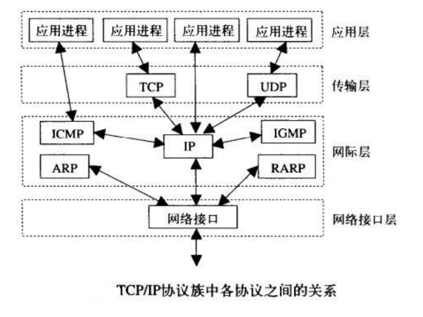

# 网络基础

##TCP/IP



###四层

1. 链路层（物理层+数据链路层）
2. 网络层（网络层）
3. 传输层（传输层）
4. 应用层（会话层+表示层+应用层）

网际层也称为：网络层
网络接口层也称为：链路层

## 端口

0~65535

* 知名端口号（0~1023）
* 动态端口号（1024~65535）

`netstat -an` 查看端口号

## IP


### 类别

* A ：一个A类IP地址由1字节的网络地址和3字节主机地址组成，网络地址的最高
  位必须是“0”，
  地址范围1.0.0.1-126.255.255.254

  可用的A类网络有126个，每个网络能容纳1677214个主机

* B：一个B类IP地址由2个字节的网络地址和2个字节的主机地址组成，网络地址
  的最高位必须是“10”，
  地址范围128.1.0.1-191.255.255.254

  可用的B类网络有16384个，每个网络能容纳65534主机

* C：一个C类IP地址由3字节的网络地址和1字节的主机地址组成，网络地址的最
  高位必须是“110”
  范围192.0.1.1-223.255.255.254

  C类网络可达2097152个，每个网络能容纳254个主机

* D：类IP地址第一个字节以“1110”开始，它是一个专门保留的地址。
  它并不指向特定的网络，目前这一类地址被用在多点广播（Multicast）中
  多点广播地址用来一次寻址一组计算机
  地址范围224.0.0.1-239.255.255.254

* E：以“1111”开始，为将来使用保留
  E类地址保留，仅作实验和开发用

### 私有ip

10.0.0.0～10.255.255.255

172.16.0.0～172.31.255.255

192.168.0.0～192.168.255.255

**IP地址127．0．0．1~127．255．255．255用于回路测试**

## SOCKET

### 创建tcp socket

```python
import socket
s = socket.socket(socket.AF_INET #IPV4
                  , socket.SOCK_STREAM #tcp
                 )
print 'Socket Created'
```

###创建udp socket

```python
import socket
s = socket.socket(socket.AF_INET, 
                  socket.SOCK_DGRAM #udp
                 )
print 'Socket Created'
```

### socket发送数据

```python
#coding=utf-8

from socket import *

#1.创建套接字
udpsocket = socket(AF_INET, SOCK_DGRAM)

#2. 准备接受方的地址
sendAddr = ('192.168.1.3', 8080)

#3. 从键盘获取数据
# sendData = input('请输入您希望的数据：')

# sendData_str = sendData.encode() # 注意字符串格式
sendData_str = b'1323'

#4. 发送数据到指定的电脑上
udpsocket.sendto(sendData_str, sendAddr)

#5. 关闭套接字
udpsocket.close()
```

### 绑定信息

````python
#coding=utf-8

from socket import *

udpsocket = socket(AF_INET, SOCK_DGRAM)

#  绑定本地的相关信息，如果一个网络程序不绑定，则系统会随机分配
bindAddr = ('', 7788)
udpsocket.bind(bindAddr)

sendAddr = ('192.168.1.3', 8080)

sendData_str = b'456'

udpsocket.sendto(sendData_str, sendAddr)

# 等待接收对方发送的数据
recvData = udpsocket.recvfrom(1024) # 1024表示本次接收的最大字节数

# 显示接收的数据
print(recvData)
# (b'123', ('192.168.1.3', 8080))

udpsocket.close()
````

## python3编码问题


