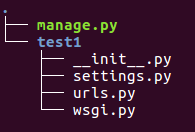
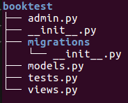
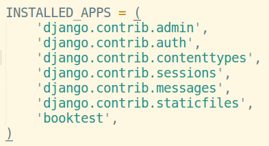
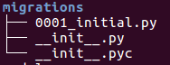
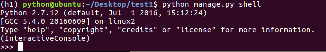
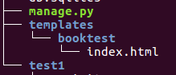

# 入门

## 搭建开发环境

### 创建虚拟环境

### 安装django

* `pip install django==1.8.2` 安装`django`

  ```python
  import django
  django.get_version()
  ```

### 创建项目

- 命令django-admin startproject test1
- 进入test1目录，目录结构如下图：



###目录说明

- `manage.py`：一个命令行工具，可以使你用多种方式对`Django`项目进行交互
- 内层的目录：项目的真正的Python包
- *_init* _.py：一个空文件，它告诉Python这个目录应该被看做一个Python包
- `settings.py`：项目的配置
- `urls.py`：项目的URL声明
- `wsgi.py`：项目与`WSGI`兼容的Web服务器入口

## 设计模型

### 数据库配置

- 在settings.py文件中，通过DATABASES项进行数据库设置
- django支持的数据库包括：sqlite、mysql等主流数据库
- **Django默认使用SQLite数据库**

### 创建应用

- 在一个项目中可以创建一到多个应用，每个应用进行一种业务处理
- 创建应用的命令：

```
python manage.py startapp booktest
```

- 应用的目录结构如下图



* `migrations` 迁移，根据当前项目中的模型类生成数据库脚本，并将脚本映射到数据中去
* `admin.py` 
* `models.py` 模型类的定义
* `tests.py`  测试模块
* `views.py` 视图和函数定义

#### 定义模型

- 有一个数据表，就有一个模型类与之对应
- 打开models.py文件，定义模型类
- 引入包from django.db import models
- 模型类继承自models.Model类
- **说明：不需要定义主键列，在生成时会自动添加，并且值为自动增长**
- 当输出对象时，会调用对象的str方法

```python
from django.db import models

class BookInfo(models.Model):
    btitle = models.CharField(max_length=20)
    bpub_date = models.DateTimeField()

    def __str__(self):
        return self.btitle

class HeroInfo(models.Model):
    hname = models.CharField(max_length=10)
    hgender = models.BooleanField()
    hcontent = models.CharField(max_length=1000)
    hbook = models.ForeignKey(BookInfo)
```

* `python manage.py runserver` 启动

#### 生成数据表

- 激活模型：编辑settings.py文件，将booktest应用加入到installed_apps中，将应用注册

  

- 生成迁移文件：根据模型类生成sql语句

  ```
  python manage.py makemigrations
  ```

- 迁移文件被生成到应用的migrations目录



- 执行迁移：执行sql语句生成数据表

```
python manage.py migrate
```

#### 测试数据操作

- 进入python shell，进行简单的模型API练习

```
python manage.py shell
```

- 进入shell后提示如下：



- 引入需要的包：

```
from booktest.models import BookInfo,HeroInfo
from django.utils import timezone
from datetime import *
```

- 查询所有图书信息：

```
BookInfo.objects.all()
```

- 新建图书信息：

```
b = BookInfo()
b.btitle="射雕英雄传"
b.bpub_date=datetime(year=1990,month=1,day=10)
b.save()
```

- 查找图书信息：

```
b=BookInfo.objects.get(pk=1)
```

- 输出图书信息：

```
b
b.id
b.btitle
```

- 修改图书信息：

```
b.btitle=u"天龙八部"
b.save()
```

- 删除图书信息：

```
b.delete()
```

#### 关联对象操作

- 对于HeroInfo可以按照上面的操作方式进行
- 添加，注意添加关联对象

```
h=HeroInfo()
h.htitle=u'郭靖'
h.hgender=True
h.hcontent=u'降龙十八掌'
h.hBook=b
h.save()
```

- 获得关联集合：返回当前book对象的所有hero

```
b.heroinfo_set.all()
```

- 有一个HeroInfo存在，必须要有一个BookInfo对象，提供了创建关联的数据：

```
h=b.heroinfo_set.create(htitle=u'黄蓉',hgender=False,hcontent=u'打狗棍法')
h
```

## 管理站点

### 打开服务

* `python manage.py runserver ip:port` 开启服务器
  * 可以不写ip，默认端口为8000
  * 这是一个纯python编写的轻量级web服务器，仅在开发阶段使用
* `python manage.py runserver 8080`默认端口是8000，可以修改端口
  * 打开浏览器，输入网址“127.0.0.1:8000”可以打开默认页面
  * 如果修改文件不需要重启服务器，如果增删文件需要重启服务器

### 管理操作

* 站点分为“内容发布”和“公共访问”两部分
* 内容发布”的部分负责添加、修改、删除内容，开发这些重复的功能是一件单调乏味、缺乏创造力的工作。为此，Django会根据定义的模型类完全自动地生成管理模块

####使用django 的管理

- 创建一个管理员用户

  ```
  python manage.py createsuperuser，按提示输入用户名、邮箱、密码
  ```

- 启动服务器，通过“127.0.0.1:8000/admin”访问，输入上面创建的用户名、密码完成登录

- 进入管理站点，默认可以对groups、users进行管理

#### 管理界面本地化

- 编辑settings.py文件，设置编码、时区

```
LANGUAGE_CODE = 'zh-Hans'
TIME_ZONE = 'Asia/Shanghai'
```

#### 注册模型

- 打开booktest/admin.py文件，注册模型

```
from django.contrib import admin
from models import BookInfo
admin.site.register(BookInfo)
```

- 刷新管理页面，可以对BookInfo的数据进行增删改查操作
- 问题：如果在str方法中返回中文，在修改和添加时会报ascii的错误
- 解决：在str()方法中，将字符串末尾添加“.encode('utf-8')”（当内容信息为中文时出错）

#### 自定义管理页面

- Django提供了admin.ModelAdmin类
- 通过定义ModelAdmin的子类，来定义模型在Admin界面的显示方式

```
class QuestionAdmin(admin.ModelAdmin):
    ...
admin.site.register(Question, QuestionAdmin)
```

##### 列表页属性

- list_display：显示字段，可以点击列头进行排序

  ```python
  # -*- coding:utf-8 -*-
  from django.contrib import admin

  # Register your models here.
  from models import BookInfo
  from models import HeroInfo

  class BookInfoAdmin(admin.ModelAdmin):
      list_display = ['id', 'btitle', 'bpub_date']

  admin.site.register(BookInfo, BookInfoAdmin) #记得要注册进去
  admin.site.register(HeroInfo)
  ```

- list_filter：过滤字段，过滤框会出现在右侧

  ```
  list_filter = ['btitle']
  ```

- search_fields：搜索字段，搜索框会出现在上侧，支持模糊查询

  ```
  search_fields = ['btitle']
  ```

- list_per_page：分页，分页框会出现在下侧

  ```
  list_per_page = 10
  ```

##### 添加、修改页属性

- fields：属性的先后顺序

```
fields = ['bpub_date', 'btitle']
```

- fieldsets：属性分组

```
fieldsets = [
    ('basic',{'fields': ['btitle']}),
    ('more', {'fields': ['bpub_date']}),
]
```

````python
# -*- coding:utf-8 -*-
from django.contrib import admin

# Register your models here.
from models import BookInfo
from models import HeroInfo

class BookInfoAdmin(admin.ModelAdmin):
    list_display = ['id', 'btitle', 'bpub_date']
    list_filter = ['btitle']
    search_fields = ['btitle']
    list_per_page = 1

    # fields = ['bpub_date', 'btitle']
    fieldsets = [
        ('base', {'fields': ['btitle']}),
        ('super', {'fields': ['bpub_date']}),
    ]


admin.site.register(BookInfo, BookInfoAdmin) #记得要注册进去
admin.site.register(HeroInfo)
````

### 关联对象

- 对于HeroInfo模型类，有两种注册方式
  - 方式一：与BookInfo模型类相同
  - 方式二：关联注册
- 按照BookInfor的注册方式完成HeroInfo的注册
- 接下来实现关联注册

```python
# -*- coding:utf-8 -*-
from django.contrib import admin

from models import BookInfo
from models import HeroInfo


# class HeroInfoInline(admin.StackedInline):
class HeroInfoInline(admin.TabularInline): # 表格形式
    model = HeroInfo
    extra = 3


class BookInfoAdmin(admin.ModelAdmin):
    list_display = ['id', 'btitle', 'bpub_date']
    list_filter = ['btitle']
    search_fields = ['btitle']

    # fields = ['bpub_date', 'btitle']

    inlines = [HeroInfoInline]


admin.site.register(BookInfo, BookInfoAdmin)
admin.site.register(HeroInfo)
```

### 布尔值的显示

- 发布性别的显示不是一个直观的结果，可以使用方法进行封装

```python
def gender(self):
    if self.hgender:
        return '男'
    else:
        return '女'
gender.short_description = '性别'

```

- 在admin注册中使用gender代替hgender

```python
class HeroInfoAdmin(admin.ModelAdmin):
    list_display = ['id', 'hname', 'gender', 'hcontent']
```

## 视图

1. 在项目视图中创建被访问的函数

   ```python
   # views.py
   # from django.shortcuts import render
   from django.http import *

   def index(request):
       return HttpResponse('hello world')
   ```

2. 在主配置路由配置文件中配置项目路由

   ```python
   from django.conf.urls import include, url
   from django.contrib import admin

   urlpatterns = [
       url(r'^admin/', include(admin.site.urls)),
       url(r'^', include('booktest.urls'))
   ```

3. 在项目路由中配置执行的函数

   ```python
   from django.conf.urls import url
   from . import views

   urlpatterns = [
       url(r'^$', views.index)
   ]
   ```

## 模版

- 模板是html页面，可以根据视图中传递的数据填充值

1. 创建模板的目录如下图：



2. 修改settings.py文件，设置TEMPLATES的DIRS值

```
'DIRS': [os.path.join(BASE_DIR, 'templates')],
```

3. 在视图中引入

```python
# views.py
from django.http import *
from django.template import RequestContext,loader

def index(request):
    temp = loader.get_template('booktest/index.html')
    return HttpResponse(temp.render())
```

````python
# views.py
from django.http import *
from django.shortcuts import render

def index(request):
    return render(request, 'booktest/index.html')
````

4. 在模板中访问视图传递的数据

````python
# views.py
from django.http import *
from django.shortcuts import render
from .models import *

def index(request):
    booklist = BookInfo.objects.all()

    context = {
        'list': booklist,
        'title': '标题'
    }
    return render(request, 'booktest/index.html', context)
````

```html
<!DOCTYPE html>
<html lang="en">
<head>
    <meta charset="UTF-8">
    <title>Title</title>
</head>
<body>
<ul>

<li>{{book.btitle}}</li>

</ul>
<h1>{{title}}</h1>
</body>
</html>
```
#### 跳转显示所有信息

1. 创建模版

   ```html
   # booktest/show.html
   <!DOCTYPE html>
   <html lang="en">
   <head>
       <meta charset="UTF-8">
       <title>Title</title>
   </head>
   <body>
   </body>
   </html>
   ```

2. 设置路由

   ````python
   urlpatterns = [
       url(r'^index$', views.index),
       url(r'^show\/(\d+)$', views.show),
   ]
   ````

3. 读取数据

   ```python
   def show(request, id): #正则匹配获得的参数
       book = BookInfo.objects.get(pk=id)
       list = book.heroinfo_set.all()
       context = {
           'list': list
       }
       return render(request, 'booktest/show.html', context)

   ```

4. 遍历显示

   ```python
   # booktest/show.html
   <!DOCTYPE html>
   <html lang="en">
   <head>
       <meta charset="UTF-8">
       <title>Title</title>
   </head>
   <body>
   
   <li>{{hero.hname}}</li>
   
   </body>
   </html>
   ```

   ​