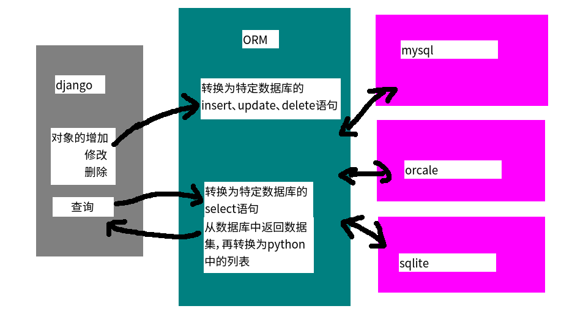

# django模型

1. 创建虚拟环境
2. 安装django
3. 创建项目
4. 创建应用
5. 在models.py中定义模型类
6. 定义视图
7. 配置URL
8. 创建模版

## ORM



* `pip install mysql-python` 安装`mysql`包(http://www.codegood.com/archives/129)

* `django-admin startproject test2` 创建项目

* `cd test2`

* `CREATE DATABASE test2 CHARSET=utf8` 创建数据库

* 修改配置 `test2\settings.py`

  ```python
  DATABASES = {
      # 'default': {
      #     'ENGINE': 'django.db.backends.sqlite3',
      #     'NAME': os.path.join(BASE_DIR, 'db.sqlite3'),
      # }

      'default': {
          'ENGINE': 'django.db.backends.mysql',
          'NAME': 'test2',
          'USER': 'root',
          'PASSWORD': 'root',
          'HOST': '127.0.0.1',
          'PORT': '3306',
      }
  }
  ```

* `python manage.py startapp booktest`创建应用

* 添加到settings.py

  ```python
  INSTALLED_APPS = (
      'django.contrib.admin',
      'django.contrib.auth',
      'django.contrib.contenttypes',
      'django.contrib.sessions',
      'django.contrib.messages',
      'django.contrib.staticfiles',
      'booktest'
  )
  ```

## 定义模型

###定义模型

- 在模型中定义属性，会生成表中的字段
- django根据属性的类型确定以下信息：
  - 当前选择的数据库支持字段的类型
  - 渲染管理表单时使用的默认html控件
  - 在管理站点最低限度的验证
- django会为表增加自动增长的主键列，每个模型只能有一个主键列，如果使用选项设置某属性为主键列后，则django不会再生成默认的主键列
- 属性命名限制
  - 不能是python的保留关键字
  - 由于django的查询方式，不允许使用连续的下划线

###定义属性

- 定义属性时，需要字段类型
- 字段类型被定义在django.db.models.fields目录下，为了方便使用，被导入到django.db.models中
- 使用方式
  1. 导入from django.db import models
  2. 通过models.Field创建字段类型的对象，赋值给属性
- **对于重要数据都做逻辑删除，不做物理删除，实现方法是定义isDelete属性，类型为BooleanField，默认值为False**

#### 字段类型

- AutoField：一个根据实际ID自动增长的IntegerField，通常不指定
  - 如果不指定，一个主键字段将自动添加到模型中
- BooleanField：true/false 字段，此字段的默认表单控制是CheckboxInput
- NullBooleanField：支持null、true、false三种值
- CharField(max_length=字符长度)：字符串，默认的表单样式是 TextInput
- TextField：大文本字段，一般超过4000使用，默认的表单控件是Textarea
- IntegerField：整数
- DecimalField(max_digits=None, decimal_places=None)：使用python的Decimal实例表示的十进制浮点数
  - DecimalField.max_digits：位数总数
  - DecimalField.decimal_places：小数点后的数字位数
- FloatField：用Python的float实例来表示的浮点数
- DateField[auto_now=False, auto_now_add=False])：使用Python的datetime.date实例表示的日期
  - 参数DateField.auto_now：每次保存对象时，自动设置该字段为当前时间，用于"最后一次修改"的时间戳，它总是使用当前日期，默认为false
  - 参数DateField.auto_now_add：当对象第一次被创建时自动设置当前时间，用于创建的时间戳，它总是使用当前日期，默认为false
  - 该字段默认对应的表单控件是一个TextInput. 在管理员站点添加了一个JavaScript写的日历控件，和一个“Today"的快捷按钮，包含了一个额外的invalid_date错误消息键
  - auto_now_add, auto_now, and default 这些设置是相互排斥的，他们之间的任何组合将会发生错误的结果
- TimeField：使用Python的datetime.time实例表示的时间，参数同DateField
- DateTimeField：使用Python的datetime.datetime实例表示的日期和时间，参数同DateField
- FileField：一个上传文件的字段
- ImageField：继承了FileField的所有属性和方法，但对上传的对象进行校验，确保它是个有效的image

#### 字段选项

- 通过字段选项，可以实现对字段的约束
- 在字段对象时通过关键字参数指定
- null：如果为True，Django 将空值以NULL 存储到数据库中，默认值是 False
- blank：如果为True，则该字段允许为空白，默认值是 False
- **对比：null是数据库范畴的概念，blank是表单验证证范畴的**
- db_column：字段的名称，如果未指定，则使用属性的名称
- db_index：若值为 True, 则在表中会为此字段创建索引
- default：默认值
- primary_key：若为 True, 则该字段会成为模型的主键字段
- unique：如果为 True, 这个字段在表中必须有唯一值

#### 关系

- 关系的类型包括
  - ForeignKey：一对多，将字段定义在多的端中
  - ManyToManyField：多对多，将字段定义在两端中
  - OneToOneField：一对一，将字段定义在任意一端中
- 可以维护递归的关联关系，使用'self'指定，详见“自关联”
- 用一访问多：对象.模型类小写_set

```python
BookInfo
HerInfo
	book=models.ForeignKey(BookInfo)
	
book.heroinfo_set 将获得BookInfo对应的所有heroinfo信息
hero.book 某一个英雄对应的书，直接通过对象属性获得
```

- 用一访问一：对象.模型类小写

```
heroinfo.bookinfo
```

- 访问id：对象.属性_id

```
heroinfo.book_id
```

### 元选项

- 在模型类中定义类Meta，用于设置元信息
- 元信息db_table：定义数据表名称，推荐使用小写字母，数据表的默认名称

```
<app_name>_<model_name>
```

- ordering：对象的默认排序字段，获取对象的列表时使用，接收属性构成的列表

```
class BookInfo(models.Model):
    ...
    class Meta():
        ordering = ['id']
```

- 字符串前加-表示倒序，不加-表示正序

```
class BookInfo(models.Model):
    ...
    class Meta():
        ordering = ['-id']
```

- 排序会增加数据库的开销

### 创建模型

```
# -*- coding: UTF-8 -*-
from django.db import models

class BookInfo(models.Model):
    btitle = models.CharField(max_length=20)
    bpub_date = models.DateTimeField()
    bread = models.IntegerField(default = 0) #阅读量
    bcommet = models.IntegerField(default = 0) # 评分数量
    isDelete = models.BooleanField(default = False) # 是否删除

    class Meta:
        db_table = 'bookinfo' #指定表名称
        ordering = ['-id'] # 指定倒叙，但数据库开销会变大

class HeroInfo(models.Model):
    hname = models.CharField(max_length=10)
    hgender = models.BooleanField(default = True)
    isDelete = models.BooleanField(default = False)
    hcontent = models.CharField(max_length=1000)
    hbook = models.ForeignKey('BookInfo')
```

* `python2 manage.py makemigrations`迁移
* `python2 ` 生成迁移

```
insert into bookinfo(btitle,bpub_date,bread,bcommet,isDelete) values
('射雕英雄传','1980-5-1',12,34,0),
('天龙八部','1986-7-24',36,40,0),
('笑傲江湖','1995-12-24',20,80,0),
('雪山飞狐','1987-11-11',58,24,0)

insert into booktest_heroinfo(hname,hgender,hbook_id,hcontent,isDelete) values
('郭靖',1,1,'降龙十八掌',0),
('黄蓉',0,1,'打狗棍法',0),
('黄药师',1,1,'弹指神通',0),
('欧阳锋',1,1,'蛤蟆功',0),
('梅超风',0,1,'九阴白骨爪',0),
('乔峰',1,2,'降龙十八掌',0),
('段誉',1,2,'六脉神剑',0),
('虚竹',1,2,'天山六阳掌',0),
('王语嫣',0,2,'神仙姐姐',0),
('令狐冲',1,3,'独孤九剑',0),
('任盈盈',0,3,'弹琴',0),
('岳不群',1,3,'华山剑法',0),
('东方不败',0,3,'葵花宝典',0),
('胡斐',1,4,'胡家刀法',0),
('苗若兰',0,4,'黄衣',0),
('程灵素',0,4,'医术',0),
('袁紫衣',0,4,'六合拳',0)
```

## 模型成员

### 类的属性

- objects：是Manager类型的对象，用于与数据库进行交互，ORM的核心
- 当定义模型类时没有指定管理器，则Django会为模型类提供一个名为objects的管理器
- 支持明确指定模型类的管理器

```
class BookInfo(models.Model):
    ...
    books = models.Manager()
```

- 当为模型类指定管理器后，django不再为模型类生成名为objects的默认管理器

### 管理器Manager

- 管理器是Django的模型进行数据库的查询操作的接口，Django应用的每个模型都拥有至少一个管理器
- 自定义管理器类主要用于两种情况
- 情况一：向管理器类中添加额外的方法：见下面“创建对象”中的方式二
- 情况二：修改管理器返回的原始查询集：重写get_queryset()方法

```
class BookInfoManager(models.Manager):
    def get_queryset(self):
        return super(BookInfoManager, self).get_queryset().filter(isDelete=False)
class BookInfo(models.Model):
    ...
    books = BookInfoManager()
```

### 创建对象

- 当创建对象时，django不会对数据库进行读写操作
- 调用save()方法才与数据库交互，将对象保存到数据库中
- 使用关键字参数构造模型对象很麻烦，推荐使用下面的两种之式
- 说明：* _init* _方法已经在基类models.Model中使用，在自定义模型中无法使用，
- 方式一：在模型类中增加一个类方法

```
class BookInfo(models.Model):
    ...
    @classmethod
    def create(cls, title, pub_date):
        book = cls(btitle=title, bpub_date=pub_date)
        book.bread=0
        book.bcommet=0
        book.isDelete = False
        return book
引入时间包：from datetime import *
调用：book=BookInfo.create("hello",datetime(1980,10,11));
保存：book.save()

```

- 方式二：在自定义管理器中添加一个方法
- 在管理器的方法中，可以通过self.model来得到它所属的模型类

```
class BookInfoManager(models.Manager):
    def create_book(self, title, pub_date):
        book = self.model()
        book.btitle = title
        book.bpub_date = pub_date
        book.bread=0
        book.bcommet=0
        book.isDelete = False
        return book

class BookInfo(models.Model):
    ...
    books = BookInfoManager()
调用：book=BookInfo.books.create_book("abc",datetime(1980,1,1))
保存：book.save()

```

- 在方式二中，可以调用self.create()创建并保存对象，不需要再手动save()

```
class BookInfoManager(models.Manager):
    def create_book(self, title, pub_date):
        book = self.create(btitle = title,bpub_date = pub_date,bread=0,bcommet=0,isDelete = False)
        return book

class BookInfo(models.Model):
    ...
    books = BookInfoManager()
调用：book=Book.books.create_book("abc",datetime(1980,1,1))
查看：book.pk
```

### 实例属性

- DoesNotExist：在进行单个查询时，模型的对象不存在时会引发此异常，结合try/except使用

### 实例方法

- str **(self)：重写object方法，此方法在将对象转换成字符串时会被调用
- save()：将模型对象保存到数据表中
- delete()：将模型对象从数据表中删除

## 模型查询

## 自连接

