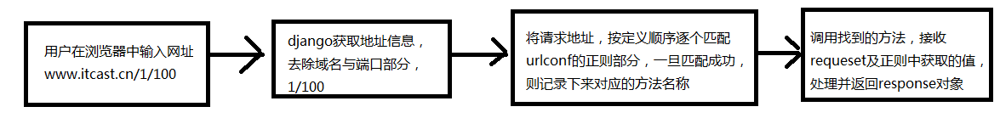

# 视图

<<<<<<< HEAD
=======


## URLconf

- 在settings.py文件中通过ROOT_URLCONF指定根级url的配置
- urlpatterns是一个url()实例的列表
- 一个url()对象包括：
  - 正则表达式
  - 视图函数
  - 名称name
- 编写URLconf的注意：
  - 若要从url中捕获一个值，需要在它周围设置一对圆括号
  - 不需要添加一个前导的反斜杠，如应该写作'test/'，而不应该写作'/test/'
  - 每个正则表达式前面的r表示字符串不转义
- 请求的url被看做是一个普通的python字符串，进行匹配时不包括get或post请求的参数及域名

```
http://www.itcast.cn/python/1/?i=1&p=new，只匹配“/python/1/”部分

```

- 正则表达式非命名组，通过位置参数传递给视图

```
url(r'^([0-9]+)/$', views.detail, name='detail'),

```

- 正则表达式命名组，通过关键字参数传递给视图，本例中关键字参数为id

```
url(r'^(?P<id>[0-9]+)/$', views.detail, name='detail'),

```

- 参数匹配规则：优先使用命名参数，如果没有命名参数则使用位置参数
- 每个捕获的参数都作为一个普通的python字符串传递给视图
- 性能：urlpatterns中的每个正则表达式在第一次访问它们时被编译，这使得系统相当快

### 包含其它的URLconfs

- 在应用中创建urls.py文件，定义本应用中的urlconf，再在项目的settings中使用include()

```
from django.conf.urls import include, url
urlpatterns = [
    url(r'^', include('booktest.urls', namespace='booktest')),
]

```

- 匹配过程：先与主URLconf匹配，成功后再用剩余的部分与应用中的URLconf匹配

```
请求http://www.itcast.cn/booktest/1/
在sesstings.py中的配置：
url(r'^booktest/', include('booktest.urls', namespace='booktest')),
在booktest应用urls.py中的配置
url(r'^([0-9]+)/$', views.detail, name='detail'),
匹配部分是：/booktest/1/
匹配过程：在settings.py中与“booktest/”成功，再用“1/”与booktest应用的urls匹配

```

- 使用include可以去除urlconf的冗余
- 参数：视图会收到来自父URLconf、当前URLconf捕获的所有参数
- 在include中通过namespace定义命名空间，用于反解析

###URL的反向解析

- 如果在视图、模板中使用硬编码的链接，在urlconf发生改变时，维护是一件非常麻烦的事情
- 解决：在做链接时，通过指向urlconf的名称，动态生成链接地址
- 视图：使用django.core.urlresolvers.reverse()函数
- 模板：使用url模板标签

```python
// test3/urls.py
from django.conf.urls import include, url
from django.contrib import admin

urlpatterns = [
    url(r'^admin/', include(admin.site.urls)),
    url(r'^booktest/', include('booktest.urls', namespace='booktest'))
]
```

```python
// booktest/urls.py
from django.conf.urls import url
import views

urlpatterns = [
    url(r'^$', views.index , name='index'),
    url(r'^(\d+)$', views.detail),
    url(r'^(?P<p1>\d+)/(?P<p2>\d+)/(?P<p3>\d+)/$', views.data),
    url(r'^.*?$', views._404)
]
```

````python
//booktest/views.py
from django.shortcuts import render
from django.http import HttpResponse

def index(request):
    return HttpResponse('hello')


def detail(request, num): # 访问booktest/123
    return HttpResponse(num)

def data(request, p1, p2, p3):
    return HttpResponse(str(p1)+'-'+str(p2)+'-'+str(p3))

def _404(request):
    return HttpResponse('404!')
````

## 视图函数

- 本质就是一个函数
- 视图的参数
  - 一个HttpRequest实例
  - 通过正则表达式组获取的位置参数
  - 通过正则表达式组获得的关键字参数
- 在应用目录下默认有views.py文件，一般视图都定义在这个文件中
- 如果处理功能过多，可以将函数定义到不同的py文件中

```
新建views1.py
#coding:utf-8
from django.http import HttpResponse
def index(request):
    return HttpResponse("你好")

在urls.py中修改配置
from . import views1
url(r'^$', views1.index, name='index'),
```

### 错误视图

- Django原生自带几个默认视图用于处理HTTP错误

#### 404 (page not found) 视图

- defaults.page_not_found(request, template_name='404.html')
- 默认的404视图将传递一个变量给模板：request_path，它是导致错误的URL
- 如果Django在检测URLconf中的每个正则表达式后没有找到匹配的内容也将调用404视图
- 如果在settings中DEBUG设置为True，那么将永远不会调用404视图，而是显示URLconf 并带有一些调试信息
- 在templates中创建404.html

```
<!DOCTYPE html>
<html>
<head>
    <title></title>
</head>
<body>
找不到了
<hr/>
{{request_path}}
</body>
</html>
```

- 在settings.py中修改调试

```
DEBUG = False
ALLOWED_HOSTS = ['*', ]
```

- 请求一个不存在的地址

```
http://127.0.0.1:8000/test/
```

#### 500 (server error) 视图

- defaults.server_error(request, template_name='500.html')
- 在视图代码中出现运行时错误
- 默认的500视图不会传递变量给500.html模板
- 如果在settings中DEBUG设置为True，那么将永远不会调用505视图，而是显示URLconf 并带有一些调试信息

#### 400 (bad request) 视图

- defaults.bad_request(request, template_name='400.html')
- 错误来自客户端的操作
- 当用户进行的操作在安全方面可疑的时候，例如篡改会话cookie

##   Request对象

###基本

- 服务器接收到http协议的请求后，会根据报文创建HttpRequest对象
- 视图函数的第一个参数是HttpRequest对象
- 在django.http模块中定义了HttpRequest对象的API

####属性

- 下面除非特别说明，属性都是只读的
- path：一个字符串，表示请求的页面的完整路径，不包含域名
- method：一个字符串，表示请求使用的HTTP方法，常用值包括：'GET'、'POST'
- encoding：一个字符串，表示提交的数据的编码方式
  - 如果为None则表示使用浏览器的默认设置，一般为utf-8
  - 这个属性是可写的，可以通过修改它来修改访问表单数据使用的编码，接下来对属性的任何访问将使用新的encoding值
- GET：一个类似于字典的对象，包含get请求方式的所有参数
- POST：一个类似于字典的对象，包含post请求方式的所有参数
- FILES：一个类似于字典的对象，包含所有的上传文件
- COOKIES：一个标准的Python字典，包含所有的cookie，键和值都为字符串
- session：一个既可读又可写的类似于字典的对象，表示当前的会话，只有当Django 启用会话的支持时才可用，详细内容见“状态保持”

#### 方法

- is_ajax()：如果请求是通过XMLHttpRequest发起的，则返回True

### QueryDict对象

- 定义在django.http.QueryDict
- request对象的属性GET、POST都是QueryDict类型的对象
- 与python字典不同，QueryDict类型的对象用来处理同一个键带有多个值的情况
- 方法get()：根据键获取值
  - 只能获取键的一个值
  - 如果一个键同时拥有多个值，获取最后一个值

```
dict.get('键',default)
或简写为
dict['键']

```

- 方法getlist()：根据键获取值
  - 将键的值以列表返回，可以获取一个键的多个值

```
dict.getlist('键',default)
```

### GET属性

- QueryDict类型的对象
- 包含get请求方式的所有参数
- 与url请求地址中的参数对应，位于?后面
- 参数的格式是键值对，如key1=value1
- 多个参数之间，使用&连接，如key1=value1&key2=value2
- 键是开发人员定下来的，值是可变的
- 示例如下
- 创建视图getTest1用于定义链接，getTest2用于接收一键一值，getTest3用于接收一键多值

```
def getTest1(request):
    return render(request,'booktest/getTest1.html')
def getTest2(request):
    return render(request,'booktest/getTest2.html')
def getTest3(request):
    return render(request,'booktest/getTest3.html')

```

- 配置url

```
url(r'^getTest1/$', views.getTest1),
url(r'^getTest2/$', views.getTest2),
url(r'^getTest3/$', views.getTest3),

```

- 创建getTest1.html，定义链接

```
<html>
<head>
    <title>Title</title>
</head>
<body>
链接1：一个键传递一个值
<a href="/getTest2/?a=1&b=2">gettest2</a><br>
链接2：一个键传递多个值
<a href="/getTest3/?a=1&a=2&b=3">gettest3</a>
</body>
</html>

```

- 完善视图getTest2的代码

```
def getTest2(request):
    a=request.GET['a']
    b=request.GET['b']
    context={'a':a,'b':b}
    return render(request,'booktest/getTest2.html',context)

```

- 创建getTest2.html，显示接收结果

```
<html>
<head>
    <title>Title</title>
</head>
<body>
a:{{ a }}<br>
b:{{ b }}
</body>
</html>

```

- 完善视图getTest3的代码

```
def getTest3(request):
    a=request.GET.getlist('a')
    b=request.GET['b']
    context={'a':a,'b':b}
    return render(request,'booktest/getTest3.html',context)

```

- 创建getTest3.html，显示接收结果

```
<html>
<head>
    <title>Title</title>
</head>
<body>
a:
{{ item }}

<br>
b:{{ b }}
</body>
</html>
```

### POST属性

- QueryDict类型的对象
- 包含post请求方式的所有参数
- 与form表单中的控件对应
- 问：表单中哪些控件会被提交？
- 答：控件要有name属性，则name属性的值为键，value属性的值为键，构成键值对提交
  - 对于checkbox控件，name属性一样为一组，当控件被选中后会被提交，存在一键多值的情况
- 键是开发人员定下来的，值是可变的
- 示例如下
- 定义视图postTest1

```
def postTest1(request):
    return render(request,'booktest/postTest1.html')
```

- 配置url

```
url(r'^postTest1$',views.postTest1)
```

- 创建模板postTest1.html

```
<html>
<head>
    <title>Title</title>
</head>
<body>
<form method="post" action="/postTest2/">
    姓名：<input type="text" name="uname"/><br>
    密码：<input type="password" name="upwd"/><br>
    性别：<input type="radio" name="ugender" value="1"/>男
    <input type="radio" name="ugender" value="0"/>女<br>
    爱好：<input type="checkbox" name="uhobby" value="胸口碎大石"/>胸口碎大石
    <input type="checkbox" name="uhobby" value="跳楼"/>跳楼
    <input type="checkbox" name="uhobby" value="喝酒"/>喝酒
    <input type="checkbox" name="uhobby" value="爬山"/>爬山<br>
    <input type="submit" value="提交"/>
</form>
</body>
</html>
```

- 创建视图postTest2接收请求的数据

```
def postTest2(request):
    uname=request.POST['uname']
    upwd=request.POST['upwd']
    ugender=request.POST['ugender']
    uhobby=request.POST.getlist('uhobby')
    context={'uname':uname,'upwd':upwd,'ugender':ugender,'uhobby':uhobby}
    return render(request,'booktest/postTest2.html',context)
```

- 配置url

```
url(r'^postTest2$',views.postTest2)

```

- 创建模板postTest2.html

```
<html>
<head>
    <title>Title</title>
</head>
<body>
{{ uname }}<br>
{{ upwd }}<br>
{{ ugender }}<br>
{{ uhobby }}
</body>
</html>
```

- 注意：使用表单提交，注释掉settings.py中的中间件crsf

## Response对象

##状态保持


>>>>>>> bcf5991999500ca1fda52a477b84e52abc6ae9ef
