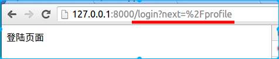

# 安全应用

## Cookie

### 设置

**set_cookie(name, value, domain=None, expires=None, path='/', expires_days=None)**

参数说明：

| 参数名          | 说明                                       |
| ------------ | ---------------------------------------- |
| name         | cookie名                                  |
| value        | cookie值                                  |
| domain       | 提交cookie时匹配的域名                           |
| path         | 提交cookie时匹配的路径                           |
| expires      | cookie的有效期，可以是时间戳整数、时间元组或者datetime类型，为**UTC时间** |
| expires_days | cookie的有效期，天数，优先级低于expires               |

````python
import datetime

class IndexHandler(RequestHandler):
    def get(self):
        self.set_cookie("n1", "v1")
        self.set_cookie("n2", "v2", path="/new", expires=time.strptime("2016-11-11 23:59:59","%Y-%m-%d %H:%M:%S"))
        self.set_cookie("n3", "v3", expires_days=20)
        # 利用time.mktime将本地时间转换为UTC标准时间
        self.set_cookie("n4", "v4", expires=time.mktime(time.strptime("2016-11-11 23:59:59","%Y-%m-%d %H:%M:%S")))
        self.write("OK")
````

### 获取

**get_cookie(name, default=None)**

获取名为name的cookie，可以设置默认值。

```
class IndexHandler(RequestHandler):
    def get(self):
        n3 = self.get_cookie("n3")
        self.write(n3)
```

### 清除

**clear_cookie(name, path='/', domain=None)**

删除名为name，并同时匹配domain和path的cookie。

**clear_all_cookies(path='/', domain=None)**

删除同时匹配domain和path的所有cookie。

```
class ClearOneCookieHandler(RequestHandler):
    def get(self):
        self.clear_cookie("n3")
        self.write("OK")

class ClearAllCookieHandler(RequestHandler):
    def get(self):
        self.clear_all_cookies()
        self.write("OK")

```

**注意：执行清除cookie操作后，并不是立即删除了浏览器中的cookie，而是给cookie值置空，并改变其有效期使其失效。真正的删除cookie是由浏览器去清理的。**

### 安全Cookie

使用安全Cookie需要为应用配置一个用来给Cookie进行混淆的秘钥cookie_secret，将其传递给Application的构造函数。我们可以使用如下方法来生成一个随机字符串作为cookie_secret的值。

```
>>> import base64, uuid
>>> base64.b64encode(uuid.uuid4().bytes + uuid.uuid4().bytes)
'2hcicVu+TqShDpfsjMWQLZ0Mkq5NPEWSk9fi0zsSt3A='
```

将生成的cookie_secret传入Application构造函数：

```
app = tornado.web.Application(
    [(r"/", IndexHandler),],
    cookie_secret = "2hcicVu+TqShDpfsjMWQLZ0Mkq5NPEWSk9fi0zsSt3A="
)
```

### 获取和设置

#### set_secure_cookie(name, value, expires_days=30)

设置一个带签名和时间戳的cookie，防止cookie被伪造。

#### get_secure_cookie(name, value=None, max_age_days=31)

如果cookie存在且验证通过，返回cookie的值，否则返回None。max_age_day不同于expires_days，expires_days是设置浏览器中cookie的有效期，而max_age_day是过滤安全cookie的时间戳。

```
class IndexHandler(RequestHandler):
    def get(self):
        cookie = self.get_secure_cookie("count")
        count = int(cookie) + 1 if cookie else 1
        self.set_secure_cookie("count", str(count))
        self.write(
            '<html><head><title>Cookie计数器</title></head>'
            '<body><h1>您已访问本页%d次。</h1>' % count + 
            '</body></html>'
        )
```

我们看签名后的cookie值：

```
"2|1:0|10:1476412069|5:count|4:NQ==|cb5fc1d4434971de6abf87270ac33381c686e4ec8c6f7e62130a0f8cbe5b7609"
```

字段说明：

1. 安全cookie的版本，默认使用版本2，不带长度说明前缀
2. 默认为0
3. 时间戳
4. cookie名
5. base64编码的cookie值
6. 签名值，不带长度说明前缀

**注意：Tornado的安全cookie只是一定程度的安全，仅仅是增加了恶意修改的难度。Tornado的安全cookies仍然容易被窃听，而cookie值是签名不是加密，攻击者能够读取已存储的cookie值，并且可以传输他们的数据到任意服务器，或者通过发送没有修改的数据给应用伪造请求。因此，避免在浏览器cookie中存储敏感的用户数据是非常重要的。**

## XSRF

只能保护有数据的请求POST、PUT和DELETE请求

### 开启xsrf保护

要开启XSRF保护，需要在Application的构造函数中添加xsrf_cookies参数：

```
app = tornado.web.Application(
    [(r"/", IndexHandler),],
    cookie_secret = "2hcicVu+TqShDpfsjMWQLZ0Mkq5NPEWSk9fi0zsSt3A=",
    xsrf_cookies = True
)

```

当这个参数被设置时，Tornado将拒绝请求参数中不包含正确的_xsrf值的POST、PUT和DELETE请求。

```
class IndexHandler(RequestHandler):
    def post(self):
        self.write("hello itcast")

```

用不带_xsrf的post请求时，报出了`HTTP 403: Forbidden ('_xsrf' argument missing from POST)`的错误。

### 模版应用

在模板中使用XSRF保护，只需在模板中添加

```


```

如新建一个模板index.html

```
<!DOCTYPE html>
<html>
<head>
    <title>测试XSRF</title>
</head>
<body>
    <form method="post">
      
      <input type="text" name="message"/>
      <input type="submit" value="Post"/>
    </form>
</body>
</html>

```

后端

```
class IndexHandler(RequestHandler):
    def get(self):
        self.render("index.html")

    def post(self):
        self.write("hello itcast")

```

模板中添加的语句帮我们做了两件事：

- 为浏览器设置了_xsrf的Cookie（注意此Cookie浏览器关闭时就会失效）
- 为模板的表单中添加了一个隐藏的输入名为_xsrf，其值为_xsrf的Cookie值

渲染后的页面原码如下：

```
<!DOCTYPE html>
<html>
    <head>
        <title>测试XSRF</title>
    </head>
    <body>
        <form method="post">
            <input type="hidden" name="_xsrf" value="2|543c2206|a056ff9e49df23eaffde0a694cde2b02|1476443353"/>
            <input type="text" name="message"/>
            <input type="submit" value="Post"/>
        </form>
    </body>
</html>
```

### 非模版应用

对于不使用模板的应用来说，首先要设置_xsrf的Cookie值，可以在任意的Handler中通过获取**self.xsrf_token**的值来生成_xsrf并设置Cookie。

下面两种方式都可以起到设置_xsrf Cookie的作用。

```
class XSRFTokenHandler(RequestHandler):
    """专门用来设置_xsrf Cookie的接口"""
    def get(self):
        self.xsrf_token
        self.write("Ok")

class StaticFileHandler(tornado.web.StaticFileHandler):
    """重写StaticFileHandler，构造时触发设置_xsrf Cookie"""
    def __init__(self, *args, **kwargs):
        super(StaticFileHandler, self).__init__(*args, **kwargs)
        self.xsrf_token

```

对于请求携带_xsrf参数，有两种方式：

- 若请求体是表单编码格式的，可以在请求体中添加_xsrf参数
- 若请求体是其他格式的（如json或xml等），可以通过设置HTTP头X-XSRFToken来传递_xsrf值

#### 请求体携带_xsrf参数

新建一个页面xsrf.html：

```
<!DOCTYPE html>
<html>
<head>
    <meta charset="utf-8">
    <title>测试XSRF</title>
</head>
<body>
    <a href="javascript:;" onclick="xsrfPost()">发送POST请求</a>
    <script src="http://cdn.bootcss.com/jquery/3.1.1/jquery.min.js"></script>
    <script type="text/javascript">
        //获取指定Cookie的函数
        function getCookie(name) {
            var r = document.cookie.match("\\b" + name + "=([^;]*)\\b");
            return r ? r[1] : undefined;
        }
        //AJAX发送post请求，表单格式数据
        function xsrfPost() {
            var xsrf = getCookie("_xsrf");
            $.post("/new", "_xsrf="+xsrf+"&key1=value1", function(data) {
                alert("OK");
            });
        }
    </script>
</body>
</html>
```

#### HTTP头X-XSRFToken

新建一个页面json.html：

```
<!DOCTYPE html>
<html>
<head>
    <meta charset="utf-8">
    <title>测试XSRF</title>
</head>
<body>
    <a href="javascript:;" onclick="xsrfPost()">发送POST请求</a>
    <script src="http://cdn.bootcss.com/jquery/3.1.1/jquery.min.js"></script>
    <script type="text/javascript">
        //获取指定Cookie的函数
        function getCookie(name) {
            var r = document.cookie.match("\\b" + name + "=([^;]*)\\b");
            return r ? r[1] : undefined;
        }
        //AJAX发送post请求，json格式数据
        function xsrfPost() {
            var xsrf = getCookie("_xsrf");
            var data = {
                key1:1,
                key1:2
            };
            var json_data = JSON.stringify(data);
            $.ajax({
                url: "/new",
                method: "POST",
                headers: {
                    "X-XSRFToken":xsrf,
                },
                data:json_data,
                success:function(data) {
                    alert("OK");
                }
            })
        }
    </script>
</body>
</html>
```

## 用户验证

用户验证是指在收到用户请求后进行处理前先判断用户的认证状态（如登陆状态），若通过验证则正常处理，否则强制用户跳转至认证页面（如登陆页面）。

## authenticated装饰器

为了使用Tornado的认证功能，我们需要对登录用户标记具体的处理函数。我们可以使用@tornado.web.authenticated装饰器完成它。当我们使用这个装饰器包裹一个处理方法时，Tornado将确保这个方法的主体只有在合法的用户被发现时才会调用。

```
class ProfileHandler(RequestHandler):
    @tornado.web.authenticated
    def get(self):
        self.write("这是我的个人主页。")

```

## get_current_user()方法

装饰器@tornado.web.authenticated的判断执行依赖于请求处理类中的self.current_user属性，如果current_user值为假（None、False、0、""等），任何GET或HEAD请求都将把访客重定向到应用设置中login_url指定的URL，而非法用户的POST请求将返回一个带有403（Forbidden）状态的HTTP响应。

在获取self.current_user属性的时候，tornado会调用get_current_user()方法来返回current_user的值。也就是说，**我们验证用户的逻辑应写在get_current_user()方法中，若该方法返回非假值则验证通过，否则验证失败。**

```
class ProfileHandler(RequestHandler):
    def get_current_user(self):
        """在此完成用户的认证逻辑"""
        user_name = self.get_argument("name", None)
        return user_name 

    @tornado.web.authenticated
    def get(self):
        self.write("这是我的个人主页。")

```

## login_url设置

当用户验证失败时，将用户重定向到login_url上，所以我们还需要在Application中配置login_url。

```
class LoginHandler(RequestHandler):
    def get(self):
        """在此返回登陆页面"""
        self.write("登陆页面")

app = tornado.web.Application(
    [
        (r"/", IndexHandler),
        (r"/profile", ProfileHandler),
        (r"/login", LoginHandler),
    ],
    "login_url":"/login"
)

```

#### 想一想，完成登陆操作后应该进入哪个页面？



在login_url后面补充的next参数就是记录的跳转至登录页面前的所在位置，所以我们可以使用next参数来完成登陆后的跳转。

修改登陆逻辑：

```
class LoginHandler(RequestHandler):
    def get(self):
        """登陆处理，完成登陆后跳转回前一页面"""
        next = self.get_argument("next", "/")
        self.redirect(next+"?name=logined")
```