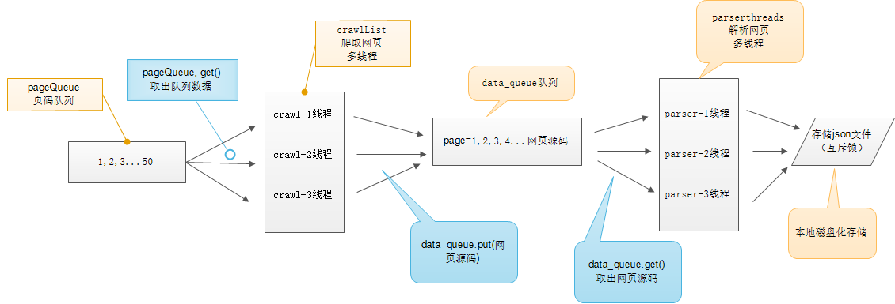

# 多线程爬虫

* 一个CPU核心一次只能执行一个任务
* 一个一次只能执行一个进程，其他进程处于非运行状态
* 进程里包含的执行单元叫线程，一个进程可以包含多个线程
* 一个进程内存空间是共享的，每个进程里的线程都可以使用这个共享空间
* 线程在使用共享空间，其他线程必须等待，用互斥锁实现
* 进程：表示程序的一次执行
* 线程：CPU运行基本调度单位
* GIL：python中的执行通行证

**python多线程适合用于大量密集的I/O处理，多进程适合CPU密集处理**

##流程

## 简单实例

