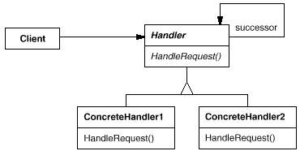

# 责任链



## 意图

使多个对象都有机会处理请求，从而避免请求的发送者和接收者之间的耦合关系。将这些对象连成一条链，并沿着这条链传递该请求，直到有一个对象处理它为止。

## 适用性

有多个的对象可以处理一个请求，哪个对象处理该请求运行时刻自动确定。

 你想在不明确指定接收者的情况下，向多个对象中的一个提交一个请求。

 可处理一个请求的对象集合应被动态指定。

## 实现

````python
#!/usr/bin/python
#coding:utf8
 
"""
Chain
"""
class Handler:
    def successor(self, successor):
        self.successor = successor
 
class ConcreteHandler1(Handler):
    def handle(self, request):
        if request > 0 and request <= 10:
            print("in handler1")
        else:
            self.successor.handle(request)
 
class ConcreteHandler2(Handler):
    def handle(self, request):
        if request > 10 and request <= 20:
            print("in handler2")
        else:
            self.successor.handle(request)
 
class ConcreteHandler3(Handler):
    def handle(self, request):
        if request > 20 and request <= 30:
            print("in handler3")
        else:
            print('end of chain, no handler for {}'.format(request))
 
class Client:
    def __init__(self):
        h1 = ConcreteHandler1()
        h2 = ConcreteHandler2()
        h3 = ConcreteHandler3()
 
        h1.successor(h2)
        h2.successor(h3)
 
        requests = [2, 5, 14, 22, 18, 3, 35, 27, 20]
        for request in requests:
            h1.handle(request)
 
if __name__ == "__main__":
    client = Client()
````

