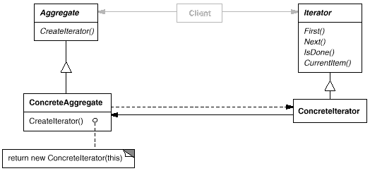

# 迭代器



## 意图

提供一种方法顺序访问一个聚合对象中各个元素, 而又不需暴露该对象的内部表示。

## 适用性

访问一个聚合对象的内容而无需暴露它的内部表示。

支持对聚合对象的多种遍历。

为遍历不同的聚合结构提供一个统一的接口(即, 支持多态迭代)。

## 实现

```python
#!/usr/bin/python
#coding:utf8
'''
Interator
'''
def count_to(count):
    """Counts by word numbers, up to a maximum of five"""
    numbers = ["one", "two", "three", "four", "five"]
    # enumerate() returns a tuple containing a count (from start which
    # defaults to 0) and the values obtained from iterating over sequence
    for pos, number in zip(range(count), numbers):
        yield number
 
# Test the generator
count_to_two = lambda: count_to(2)
count_to_five = lambda: count_to(5)
 
print('Counting to two...')
for number in count_to_two():
    print number
 
print " "
 
print('Counting to five...')
for number in count_to_five():
    print number
 
print " "
```

