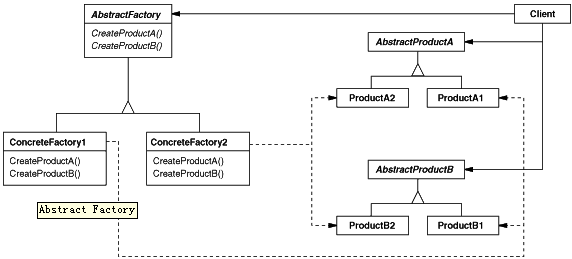

# 抽象工厂模式



## 意图

提供一个创建一系列相关或相互依赖对象的接口，而无需指定它们具体的类。

## 适用性

一个系统要独立于它的产品的创建、组合和表示时。

 一个系统要由多个产品系列中的一个来配置时。

 当你要强调一系列相关的产品对象的设计以便进行联合使用时。

 当你提供一个产品类库，而只想显示它们的接口而不是实现时。

## 实现

`````python
#coding:utf8
import random


class PetShop:
    def __init__(self, animal_factory=None):
        self.pet_factory = animal_factory

    def show_pet(self):
        pet = self.pet_factory.get_pet()
        print("This is a lovely", str(pet))
        print("It says", pet.speak())
        print("It eats", self.pet_factory.get_food())


class Animal(object):
    """
    当子类不实现该方法就直接抛出异常，终止执行
    """
    def speak(self):
        raise NameError(u'方法没有被子类实现')

    def __str__(self):
        raise NameError(u'方法没有被子类实现')


class Dog(Animal):
    def speak(self):
        return "woof"

    def __str__(self):
        return "Dog"


class Cat(Animal):
    def speak(self):
        return "meow"

    def __str__(self):
        return "Cat"


class Factory(object):
    """
        当子类不实现该方法就直接抛出异常，终止执行
    """
    def get_pet(self):
        raise NameError(u'方法没有被子类实现')

    def get_food(self):
        raise NameError(u'方法没有被子类实现')


class DogFactory(Factory):
    def get_pet(self):
        return Dog()

    def get_food(self):
        return "Dog food"


class CatFactory(Factory):
    def get_pet(self):
        return Cat()

    def get_food(self):
        return "Cat food"


def get_factory():
    return random.choice([DogFactory, CatFactory])()


if __name__ == '__main__':
    shop = PetShop()

    for i in range(4):
        shop.pet_factory = get_factory()
        shop.show_pet()
        print("=*" * 20)
`````

