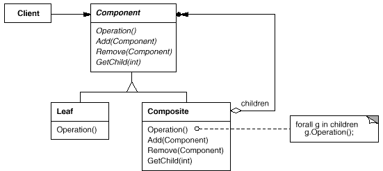

# 组合模式



## 意图

将对象组合成树形结构以表示“部分-整体”的层次结构。C o m p o s i t e 使得用户对单个对象和组合对象的使用具有一致性。

## 适用性

你想表示对象的部分-整体层次结构。

你希望用户忽略组合对象与单个对象的不同，用户将统一地使用组合结构中的所有对象。

## 实现

````python
#!/usr/bin/python
#coding:utf8
 
"""
Composite
"""
 
class Component:
    def __init__(self,strName):
        self.m_strName = strName
    def Add(self,com):
        pass
    def Display(self,nDepth):
        pass
 
class Leaf(Component):
    def Add(self,com):
        print "leaf can't add"
    def Display(self,nDepth):
        strtemp = "-" * nDepth
        strtemp=strtemp+self.m_strName
        print strtemp
 
class Composite(Component):
    def __init__(self,strName):
        self.m_strName = strName
        self.c = []
    def Add(self,com):
        self.c.append(com)
    def Display(self,nDepth):
        strtemp = "-"*nDepth
        strtemp=strtemp+self.m_strName
        print strtemp
        for com in self.c:
            com.Display(nDepth+2)
 
if __name__ == "__main__":
    p = Composite("Wong")
    p.Add(Leaf("Lee"))
    p.Add(Leaf("Zhao"))
    p1 = Composite("Wu")
    p1.Add(Leaf("San"))
    p.Add(p1)
    p.Display(1);
````

