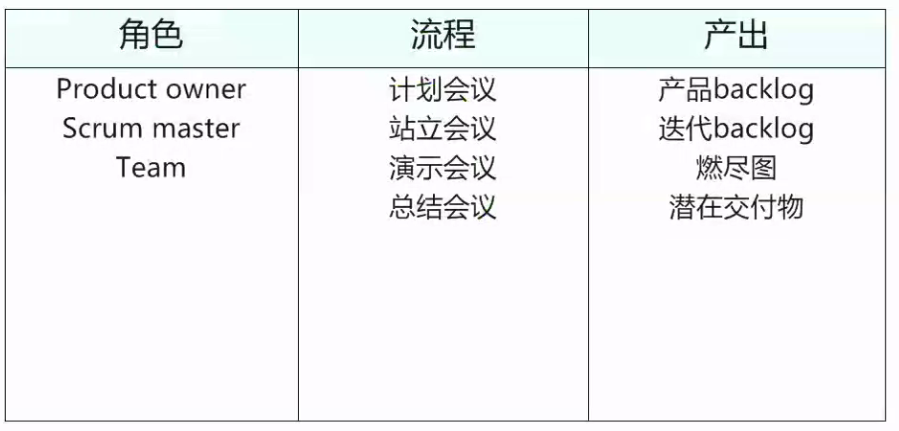
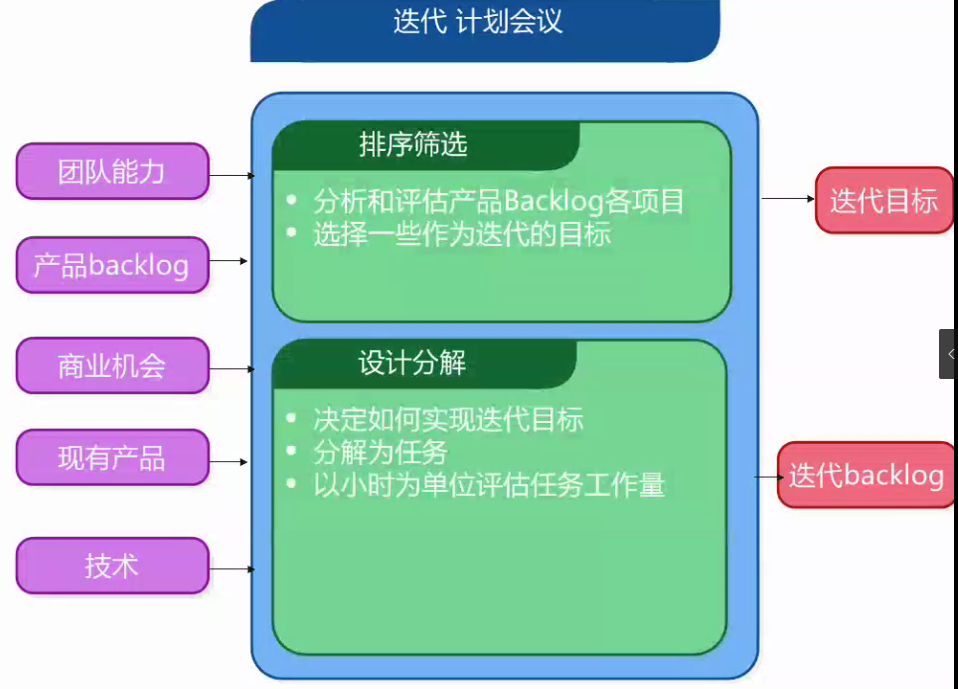
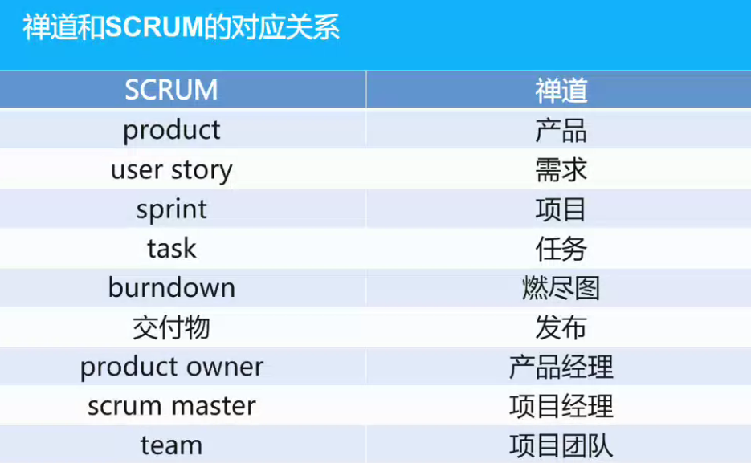
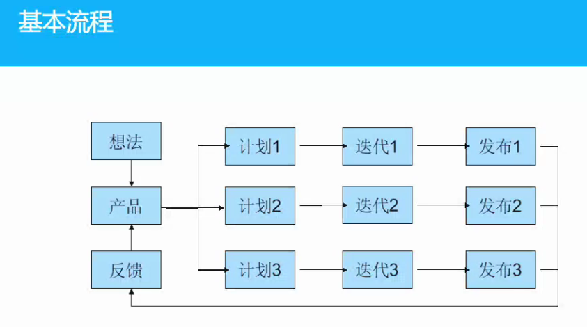
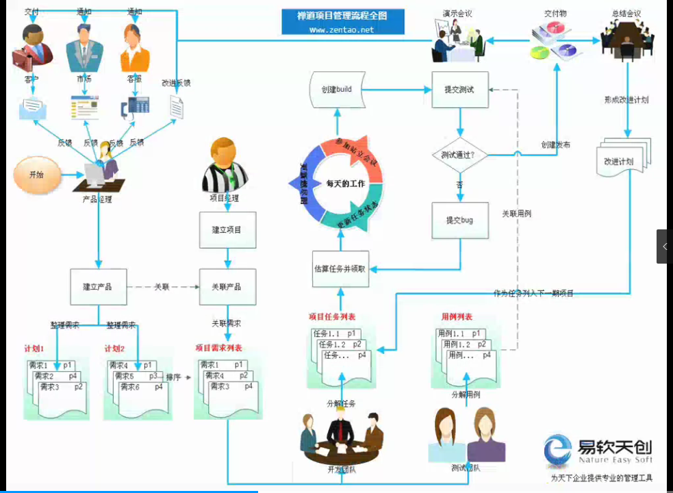

# 敏捷开发

## 价值观

### 交付

* 目标是通过尽早且持续的交付有价值的软件来满足客户
* 欢迎对需求提出变更，即便是在项目的后期
* 不断交付可用的软件，周期越短越好（1-4周）
* 可用软件是衡量进度的主要指标
* 倡导可持续开发，形成开发、销售和客户的稳定节奏

### 沟通

* 业务人员和开发人员一起工作
* 激励项目团队，给他们以所需要的资源，并信任他们
* 最有效的沟通方法是面对面的交谈

### 团队

* 团队的敏捷性依赖于对技术、过程和架构的持续改进
* 保持简洁，尽最大可能减少不必要的工作
* 最佳的架构、需求和设计出自于自组织的团队
* 定期反省总结如何改进研发过程，并制定具体的计划改进

## 极限编程

### 价值标准

* 沟通：都是团队成员，面对面沟通，从需求到编码一起努力
* 简单：聚焦当下需求，不做过多设计，通过重构来应对变化
* 反馈：系统反馈（单元测试），客户反馈，团队反馈
* 勇气：真实面对工时和进度，不惧失败，无惧将来的变化
* 尊重：尊重他人，提交可测试通过的代码，通过重构获得高质量的代码

### 原则

* 快速反馈：系统反馈，客户反馈，团队反馈
* 加谁简单：简单设计，聚焦当下
* 增量前进：小步快跑，快速迭代
* 包容变化：拥抱变化，积极应对

### 规则

* 计划：用户故事，发布计划，小型发布，迭代开发
* 管理：开放空间，可持续节奏，站立会议，评估速率，角色互换
* 设计：简单设计，隐喻，CRC卡片，原型，莫过早加入功能，角色互换
* 编码：现场客户，规范，单元测试，结对编程，持续集成，棘突所有
* 测试：单元测试覆，发布前测试通过，bug先创建测试

### 反馈

* 结对编程：质量，减少犯错，集体所有
* 计划游戏：用户故事，优先级排序
* 测试驱动开发：测试代码先行
* 客户加入团队

### 持续改进

* 持续集成：单元测试，持续集成服务器
* 重构：非重写，每时每刻都在进行
* 小版本发布：小步快跑

### 共识

* 编码规范：团队共识，尊重，集体所有基础
* 集体所有权：消除单点，知识传播
* 简单设计：参考Unix设计哲学
* 隐喻：意会，好的名字

### 程序员福利

* 可持续的节奏

### 编码

* 随时和客户沟通
* 单元测试优先
* 串行集成
* 延迟优化
* 莫加班

### 测试

* 单元测试完全覆盖
* 发布前单元测试全通过
* 发现bug后想先写测试用例
* 定期执行验收测试并公布结果

### 总结

* 结对编程
* 代码规范
* 源代码管理
* 代码review
* 每日提交
* 交叉测试
* 重构
* 分享会议
* 简单设计
* 自动化
* 框架

## Scrum

接力跑，橄榄球：整个团队通过无间的合作，灵活机动的处理接球，传球，并像一个整体一样迅速突破防线

### 精要

* scrum 聚焦如何在最短时间内交付最有价值的产品
* scrum能让团队快速且进程的监督产品的进程（2到4周）
* 每隔2-4周就可以看到上线的产品，并根据此做出调整
* 团队按照商业价值的高低，优先完成高优先级的功能
* 团队实施自主管理，持续改进团队内部的流程，提升效率

### 特点

* 团队的实施自我管理
* 产品开发以sprint为单位进行迭代
* 使用产品backlog记录产品的需求
* 没有特定的工程实践

### sprint

* SCRUM项目周期以一组迭代周期"sprints"组成
* 可以和极限开发的迭代周期类比
* 典型的迭代周期为2-4周或者最多为一个自然月
* 一个固定的周期产品才能创造出项目更优美的节奏感
* 产品的设计，开发，测试全部都在一个迭代周期内完成

### 并行工作

需求分析、设计工作、代码设计、测试是并行进行，并不是分步骤进行

一个迭代周期的长短的设定取决于多长时间内保障需求变化不影响到产品的开发

### 结构框架

### 产品所有者

* 定义所有产品功能
* 决定产品发布的内容及日期
* 对产品的投入和产出负责
* 根据市场变化对需求开发的功能排列优先顺序
* 合理的调整产品的功能和迭代顺序
* 认同或拒绝迭代的交付

### Scrum master

* 对项目的直接管理
* 领导团队完成Scrum的实践及体现价值
* 排除团队遇到的困难
* 保证团队的效率和状态
* 做好团队的协调沟通工作，跨角色跨功能协作无障碍
* 保护团队不受外部无端影响

### 团队

* 经典团队拥有：5-9人
* 跨职能的团队：开发、测试、设计等等
* 团队成员全部全职工作（列外如DBA）
* 自我管理

### 迭代计划会议

### 如何做计划

* 从产品backlog中筛选本次迭代要完成的功能列表
* 为每个功能创建任务
* 每一项任务的估计工作量应该在1-16小时左右
* 任务分解团队协作的结果，不是scrummaster一个人的决定
* 概要设计已经讨论过

### 每天的站立会议

* 每天开会
* 15分钟结束
* 站着开会
* 不是为了解决问题
* 所有相关的人被邀请
* master，产品所有者，团队成员都能够在会议上发言
* 避免无关讨论

### 站立会议内容

* 每个人回答：
  * 昨天做了什么
  * 今天计划做什么
  * 有什么问题
* 及时更新信息，发现风险

### 验收会议

* 每次迭代结束后团队需要展示本次迭代取得的进展
* 可以采用demo的方式来秀完成的功能或改进
* 提前几个小时准备即可，无需写幻灯片
* 整个团队被邀请参加
* 邀请所有关注产品的人参加

### 回顾会议

* 周期性的回顾，总结工作中的经验和教训
* 一般15-30分钟
* 在每个迭代结束时开始做
* 整个团队需要参加
  * Scrum Master
  * 产品所有者
  * 团队
  * 可能包括客户
* 决定：开始做什么，停止做什么，继续做

### Procuct Backlog

* 产品需要完成的功能列表
* 一般用户故事来组织
* 每一个用户故事都应该创造价值
* 产品所有者负责整理故事列表，对其价值进行排序
* 产品所有者应指定发布计划
* 根据实际的情况动态调整需求的排序

### SPRINT BACKLOG

* 每个人领取自己想要完成的功能，不是单纯的分配
* 每个人任务有明确的负责人和初始的估计
* 对于剩余的工作量的估计每天需要更新（指还需要的时间）
* 团队成员都可以添加，删减或者更改迭代中的任务

## 两种方式总结

* scrum偏重宏观管理
* 明确界定什么角色在什么阶段要做的事情
* 极限编程偏重工程实践
* 二者可以相互结合
* 再结合禅道作为支撑工具

## 对应概念

## 产品和项目区别

* 产品定义做什么
* 项目是如何实现

### 模块管理和计划管理

* 模块可以理解为空间上对需求的组织
* 计划可以理解为时间上对需求的组织

