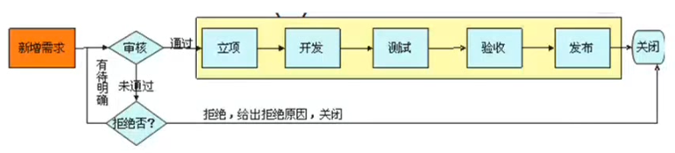
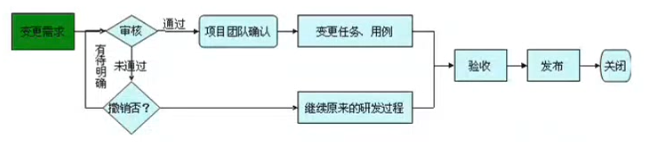

# 禅道使用笔记

## 演示项目

### 基本的步骤

* 创建帐号
* 创建产品
* 创建需求
* 创建项目、关联产品、设置团队
* 关联需求
* 分解任务
* 创建bug
* 提交测试
* 创建发布

> 职位：指在公司的角色
>
> 分组：代表当前用户的权限

### 项目参与流程

* 需求分析会议：本期项目要完成的需求列表，排序和讲解
* 站立会议：
* 需求及时沟通和确认
* 测试功能
* 需求评审会议：

## 产品经理篇

* 产品定义做什么
* 项目定义如何实现

### 新增需求的审批

* 只有激活的需求才能关联到项目中
* 创建需求时可以设置是否需要评审
* 评审的结果：确认通过，有待明确，或者拒绝
* 拒绝原因：已完成，已细分，重复，延期，不做，已取消，设计如此
* 审批的流程：一般是线上审批，或者线下开评审会议

### 需求变更流程

* 需求的变更是永远存在的
* 需求的变更和编辑操作
* 变更的影响范围
* 变更评审：确认通过，撤销变更，有待明确，拒绝
* 变更通过之后，相应开发，测试确认需求变更
* 主持演示会议
* 主持总结会议

### 需求的模块管理和计划管理

* 模块可以理解为空间上对需求的组织
* 计划可以理解为时间上对需求的组织

## 项目经理篇

## 研发团队篇

* 版本(build)和发布(release)的关系
* 完成若干功能后就提交测试
* 通过关联需求，解决bug等操作告知测试人员改动范围

## 测试团队篇

##个人篇