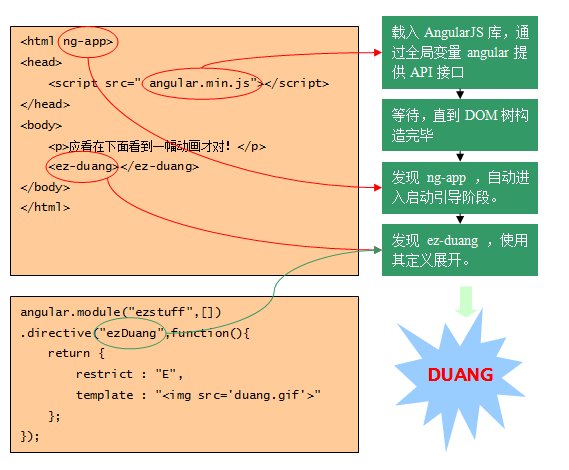

# 框架启动

## 自动引导过程



## 手动引导启动

大多数情况下，我们都使用ng-app指令来进行自动引导启动，但是如果一个HTML文件中有多个ng-app，AngularJS只会自动引导启动它找到的第一个ng-app应用，这是需要手工引导的一个应用场景。

```html
<body>
    <button id="boot">手动引导</button>
    <show></show>
</body>
<script>
    angular.element(document).ready(function () {
       var e = document.querySelector('#boot');
        angular.element(e).on('click', function () {
            angular.bootstrap(document, ['myModel']);
        })
    });

    var app = angular.module('myModel', []);
    app.directive('show', function () {
        return {
            restrict: "E",
            template: ""
        }
    })

</script>
```

## 分步进行

### 创建注入器

* 自动启动引导的场景下，可以给ng-app赋值以指定一个需要载入的模块

  ```html
  ng-app = "ezstuff";
  ```

* 手动启动引导的场景下，通过bootstrap方法的第二个参数指定需要载入的模块

  ```javascript
  angular.bootstrap(document, ["ezstuff"]);
  ```

* 无论自动启动还是手工启动，最终都是调用angular对象上的injector()方法创建了一个注入器，然后把这个注入器存入了根对象的data里

  ````javascript
  var injector = angular.injector(["ng","ezstuff"]);
  angular.element(document).data("$injector",injector);
  ````

### 创建根作用域

​	scope对象是AngularJS实现数据绑定的重要服务，所以，在引导启动建立了注入器之后，AngularJS马上在应用的根节点上创建一个根作用域：$rootScope对象。

​	如果是自动引导启动，那么ng-app所在的DOM节点对应着根作用域。如果是手工引导启动，那么在bootstrap方法中指定的第一个参数就对应着根作用域。

### 编译DOM子树

* 对DOM对象进行变换。
* 在DOM对象上挂接事件监听。
* 在DOM对象对应的scope对象上挂接数据监听。

### 编译器

HTML编译包括3个步骤

* 匹配指令

$compile遍历DOM树，如果发现有元素匹配了某个指令，那么这个指令将被加入该DOM元素的指令列表中。一个DOM元素可能匹配多个指令。

- 执行指令的编译函数

当一个DOM元素的所有指令都找齐后，编译器根据指令的优先级/priority指令进行排序。每个指令的compile函数被依次执行。每个compile执行的结果产生一个link函数，这些link函数合并成一个复合link函数。

- 执行生成的链接函数

$compile通过执行指令的link函数，将模板和scope链接起来。结果就是一个DOM视图和scope对象模型之间的动态数据绑定。

### 指令

指令是DOM元素（例如属性、元素、CSS类等）上的标记符，用来告诉AngularJS的HTML编译器（$compile服务）将特定的行为绑定到DOM元素，或者改变DOM元素。

1. 去除名称前缀的x-和data-
2. 以: , - 或 _ 为分割符，将字符串切分成单词，除第一个单词外，其余单词首字母大写
3. 重新拼接各单词


