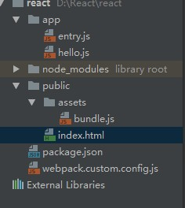

# 可以运行的项目结构



## package.json

````javascript
{
  "name": "myreact",
  "version": "1.0.0",
  "description": "",
  "main": "index.js",
  "scripts": {
    "build": "webpack --verbose --color --display-error-details --config ./webpack.custom.config.js",
    "test": "echo \"Error: no test specified\" && exit 1"
  },
  "author": "",
  "license": "ISC",
  "dependencies": {
    "babel": "^6.23.0",
    "babel-cli": "^6.24.1",
    "babel-core": "^6.24.1",
    "babel-loader": "^7.0.0",
    "babel-preset-es2015": "^6.24.1",
    "babel-preset-react": "^6.24.1",
    "css-loader": "^0.28.1",
    "jsx-loader": "^0.13.2",
    "jsxhint": "^0.15.1",
    "less-loader": "^4.0.3",
    "react-hot-loader": "^1.3.1",
    "style-loader": "^0.17.0",
    "url-loader": "^0.5.8"
  },
  "devDependencies": {
    "react": "^15.5.4",
    "react-dom": "^15.5.4"
  }
}
````

## webpack.custom.config.js

````javascript
var path = require('path');

var projectRootPath = path.resolve(__dirname, '.');

var config = {
  entry: path.resolve(projectRootPath, 'app/entry.js'),
  output: {
    path: path.resolve(projectRootPath, 'public', 'assets'),
    filename: 'bundle.js',
    publicPath: '/assets/'
  },
  module: {
    loaders: [
      {
        test: /\.js$/,
        exclude: /node_modules/,
        loader: 'babel-loader',
        query: {
          presets: ['react', 'es2015']
        }
      }
    ]
  }
};

module.exports = config;
````

## 应用

````javascript
import React from 'react'
import ReactDOM from 'react-dom'

class DOMbox extends React.Component{
  render(){
    return <h1> Hello {this.props.name}</h1>
  }
}


ReactDOM.render(<DOMbox name="辛丙亮"/>, document.getElementById('app'))
````

