# 电子加密货币与区块链

## 比特币工作原理

### 比特币网络概览

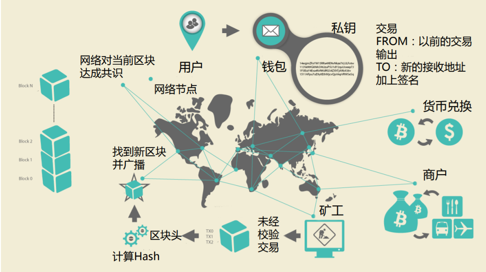

​	在整个网络中不同节点有不同的作用，并且都是依靠代币所驱动，所以所有节点是在为自己利益，但同时也是在为整个网络服务，这样就形成了优秀的正向反馈。

### 比特币交易过程

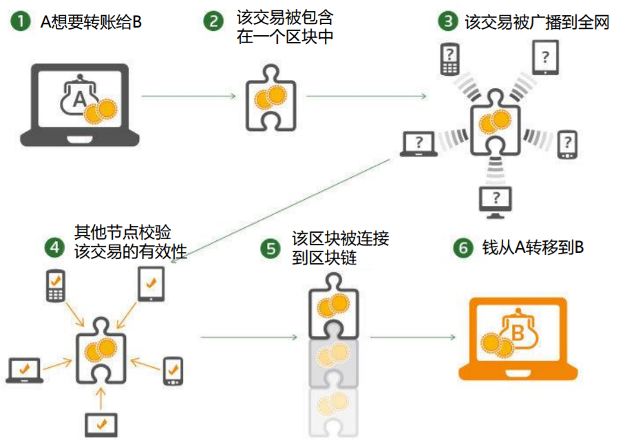

​	A用户想要转账给用户B，就把交易信息包含在一个未经校验的区块上，该交易会被广播到整个区块网络上，当矿工节点获得该广播后就会进行交易有效性的校验（即挖矿），当网络达成对该交易的共识，就会将新的区块链接到链上，此时完成转账，当然这只是交易过程的主线。

### 设计密码学的基础背景

#### 对称加密

​	加密解密使用相同的密钥（`DES`、`AES-GCM`、`ChaCha20`....），优势是对很大的数据进行加密，但密钥丢失即不再安全

### 非对称加密

​	分为公钥和私钥，公钥进行加密，私钥进行解密，并且算法公开。安全性高，但能加密的数据量有限

#### 哈希算法

​	获取一段数据的摘要，数据本身发生细微变化，将使得哈希值剧烈变化（雪崩效应），常用于校验数据是否发生变化

#### 数字签名

​	利用哈希算法特点，在将要加密的数据上加上一段额外数据，然后求Hash，在网络上将原始数据和加密后的数据一起发送，当其他人接收到该数据，使用同样方式添加额外数据，求Hash，获得的hash值和自己计算的哈希值进行比较，以确认原始数据没有被修改过。

比特币使用`ECDSA`(椭圆曲线签名算法)，其有两个特点

* 只要知道私钥，可以算出对应的公钥
* 使用私钥签名的过的东西，可以使用公钥验证是否由对应私钥签名

##私钥公钥和比特币地址

### 私钥公钥和比特币地址关系


​	由私钥可以通过`ECDSA`生成公钥，将公钥单向求hash后得到比特币地址。该过程不可逆

### 私钥公钥和比特币具体生成关系

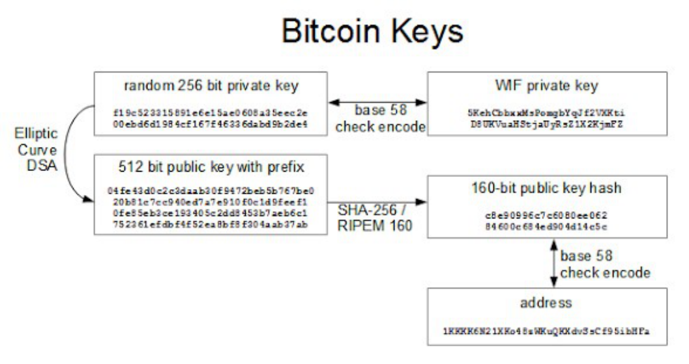

​	由随机数产生256位私钥，将私钥`ECDSA`加密得到512位私钥，将私钥求SHA-256得到160位值，以上过程不可逆。但私钥和哈希值都太长，使用base58得到位数更少的值，该过程可逆并且可以校验（检测地址合法）

### 比特币URI

```
bitcoin:1GdK9UzpHBzqzX2A9JFP3Di4weBwqgmoQA #接收方地址
?amount=0.015 #转账金额
&label=Bob%27s%20Cafe #转账说明
&message=Purchase%20at%20Bob%27s%20Cafe # 转账的额外信息
```

## 比特币交易

### 输入和输出

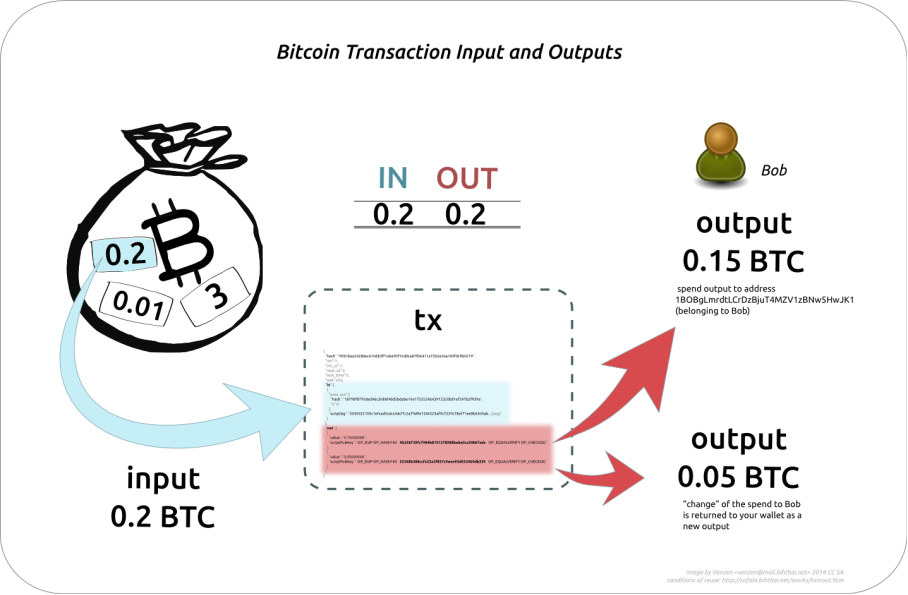

​	当发生转账时，把输出账户当作水杯A，把输入账户当作水杯C，区块网络当作中间容器B。不能直接从A到C，而是要通过B，相对于B来说资金流入，所以说是输入(input)，向C付款就是资金流出，所以说是输出(output)

### 交易链

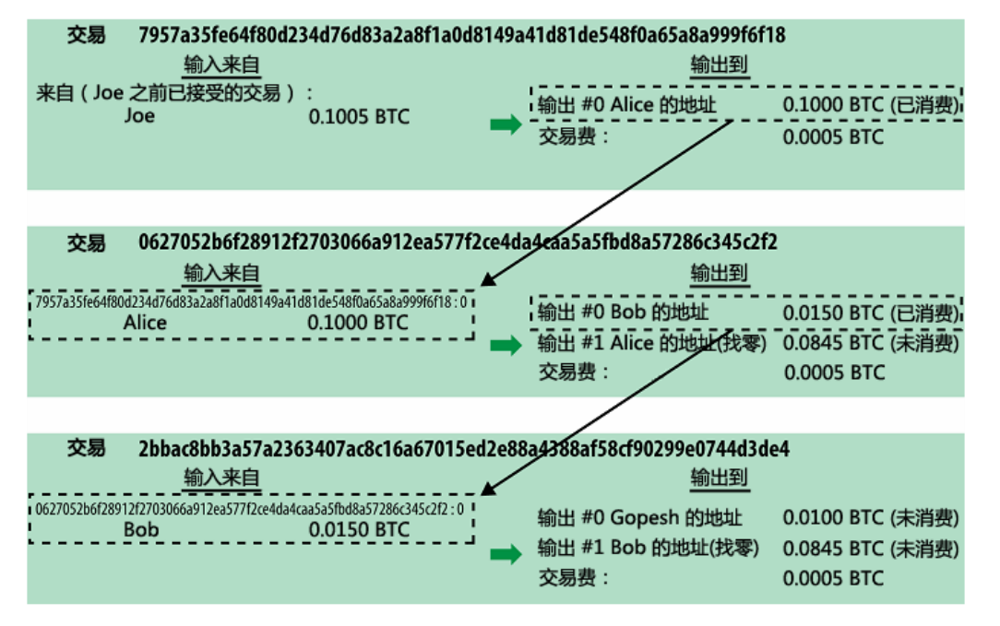

​	每一个交易都会有一个输入一个输出，并且存在上一次交易和下一次交易之间很强的练习，最后所有交易都会相关，这就形成一个交易网。手续费最后会支付给矿工，费用越高到账越快。

### UTXO（简单交易链构成的树状结构）

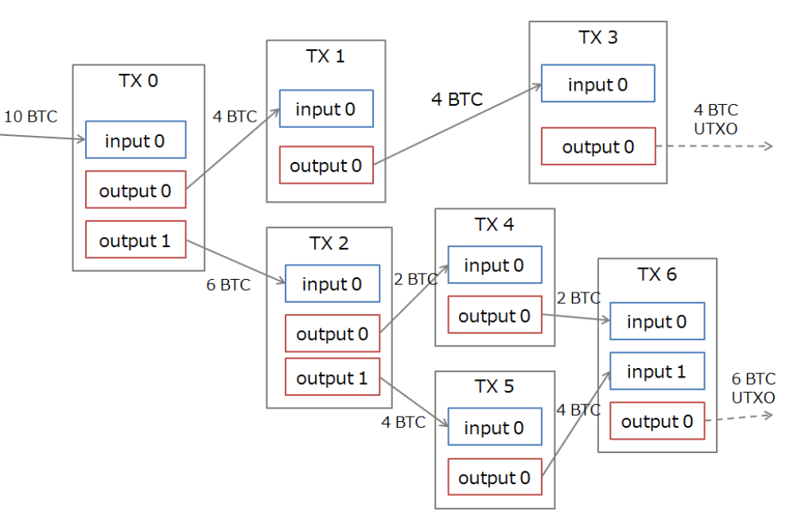

`UTXO`，tx指`transaction`，即交易，U指还没有被花费的，O指output，整个意思就是交易输出剩余，因为比特币中没有余额概念，剩余是有历史交易计算获得。交易发生时，都会尝试构建以上树状结构，以计算"余额"。

### 区块构成

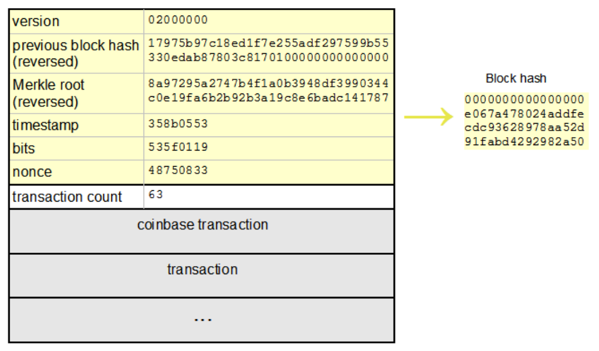

####头信息

* version 
* previous block hash  前一个区块的hash值
* Merkle root 默克尔树的根
* timestamp 时间戳
* bits 难度值
* nonce 随机树

#### 交易信息

* transaction count 包含交易数量
* coinbase transaction 一个特殊交易只有输出没有输入，

### 交易中的签名

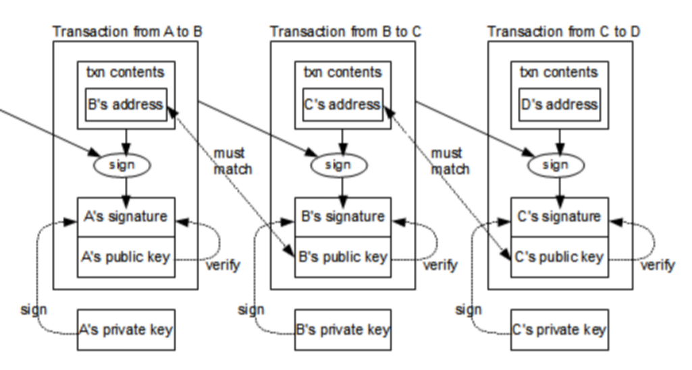

因为所有交易都会被串联在一起，当B要转账给C，但是必须验证和上一笔交易之间的关系，以证明合法性。C的地址在第二笔交易中被B的私钥签名，产生B的签名，附上B的公钥，B的公钥相对于第二笔交易是从来没有出现过的，公钥由B的地址算得。中间交易使用`ECDSA`算法，可以由公钥验证是否数据由B签名得到。中间交易必须证明两件事情：1. 交易是由B构成的（由公钥验证是否有B私钥签名）2. 由上一交易到本次交易（由地址引用）的UTXO，证明有足够的“余额”。此时交易有效。本质上是利用上一次交易的有效性证明下一次交易的有效性。

### 交易消息的构成

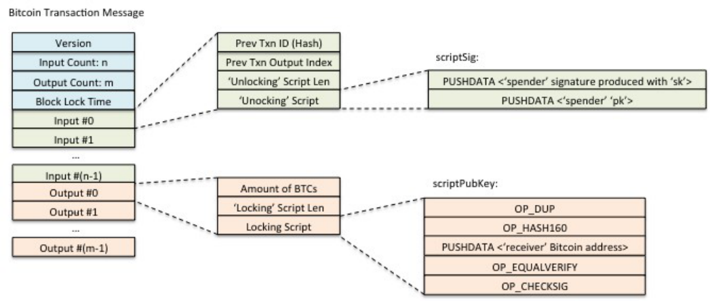

### 交易脚本

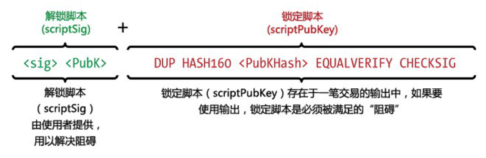

解锁脚本由使用者提供，即在发起时进行生成。锁定脚本验证解锁脚本产生的结果

### P2PKH交易

K指key，H指Hash，P2P指点对点。该脚本是指锁定脚本过程中进行的操作

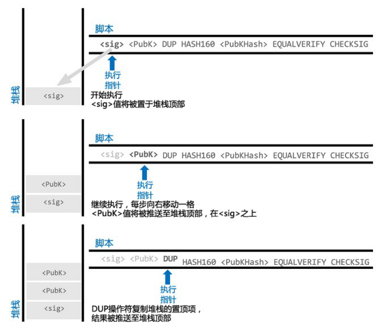

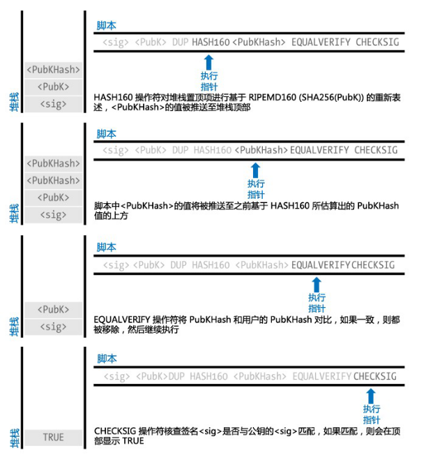

上述过程的核心就是为了判断公钥合法性，和签名是否源自私钥。所有节点收到交易消息的官博就按上述过程进行交易检验，校验完成后就会放到自己的内存中，此时还没没有形成区块。由于每个节点收到广播会受网络等因素影响，会发现前一个交易还没有到来，就先放到孤儿交易池中，只有当父交易到来才开始操作。有些客户端会构建一个`UTXO`池，以提高构建和交易速度

## 比特币网络节点类型

###基本网络节点

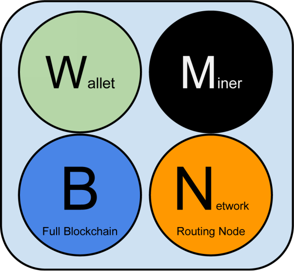

* 钱包（Wallet） 私钥生成，公钥产生，得到钱包地址，负责构建新的交易
* 矿工（Miner） 根据交易头计算新区块
* 完全区块链（Full  Blockchain） 相当于区块的数据库
* 网络路由（NetworkRouting Node）

### 拓展网络节点

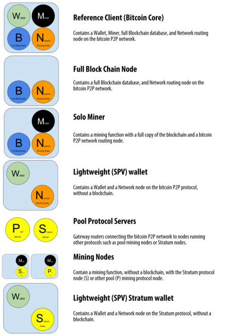

1. 参考实现结点 实现所有基础节点功能
2. 完全区块链结点  只有数据和网络的功能
3. 单独挖矿结点  数据网络挖矿功能
4. 轻量钱包结点 钱包和网络（SPV）
5. 池协议服务结点  
6. 挖矿结点
7. 轻量Stratum钱包结点

### 节点混合构成的网络

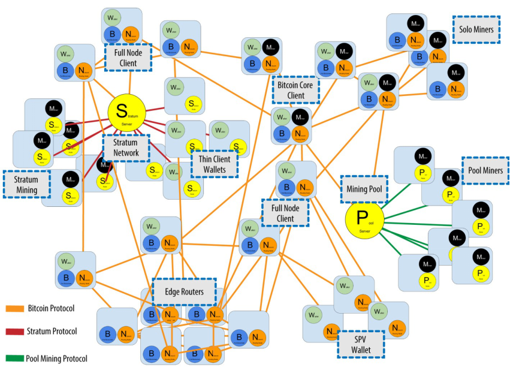

##比特币网络协议

###类别

1. Bitcoin P2P协议
   * 网络发现 (新节点如何和网络建立联系？依靠其他节点获得网络认可)
     * 默认的种子服务器
     * 通过已知的Bootstrap服务器进入
   * 握手
   * 区块信息交换
2. Stratum协议
3. 挖矿协议
4. 其他协议

### 握手

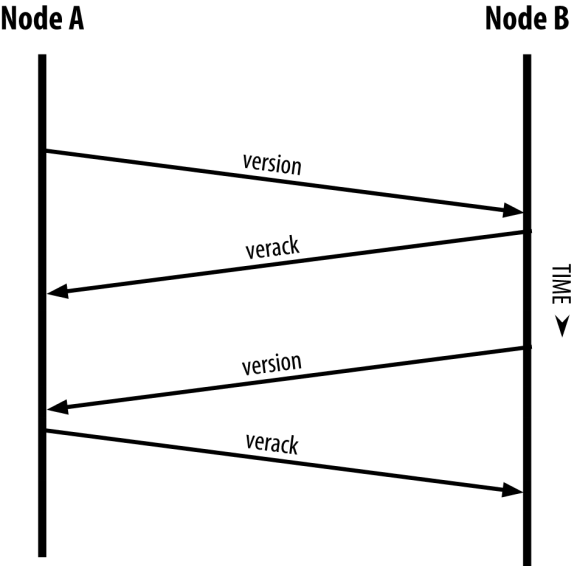

### 同步区块

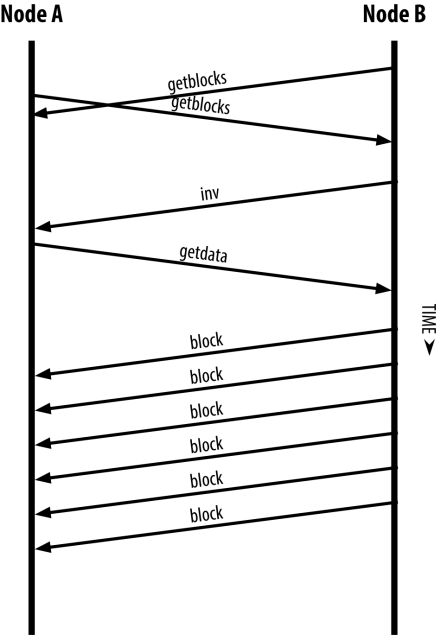

### SPV结点

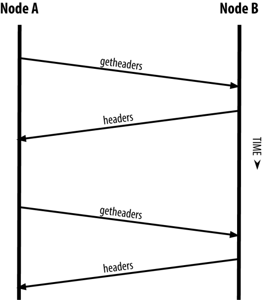 

## 比特币客户端

### Ubuntu比特币客户端编译

* 源代码位置(https://github.com/bitcoin/bitcoin)

* 下载代码

  ```
  git@github.com:bitcoin/bitcoin.git
  ```

* 安装包依赖

  ```sh
  sudo apt-get install build-essential libtool autotools-dev automake pkg-config libssl-dev libevent-dev bsdmainutils python3

  sudo apt-get install libboost-system-dev libboost-filesystem-dev libboost-chrono-dev libboost-program-options-dev libboost-test-dev libboost-thread-dev

  sudo apt-get install software-properties-common
  sudo add-apt-repository ppa:bitcoin/bitcoin
  sudo apt-get update
  sudo apt-get install libdb4.8-dev libdb4.8++-dev
  ```

* `cd bitcoin/`

* `./autogen.sh` 配置文件生成

* `./configure` 

* `make` 执行编译过程

* 项目被安装在`/usr/local/bin/`

* 默认同步的区块放在`~/.bitcoin` 

### 编译后文件说明

* bitcoind 后台应用程序
* bitcoin-cli 命令行工具
* bitcoin-qt qt版
* bitcoin-tx 

###JSON-RPC API

* `bitcoind  -printtoconsole -reindex` 重建区块，只要启动就开始同步区块

* `bitcoind -printtoconsole` 将输出控制台itcoin

* `bitcoind -daemon` 运行在后台

* `ps -A|grep bitcoind`

* `bitcoin-cli -getinfo` 查看区块信息

  ```
  {
    "version": 159900, # 版本号
    "protocolversion": 70015, # 协议版本
    "walletversion": 159900, # 钱包版本号
    "balance": 0.00000000, # 余额
    "blocks": 0, # 本地已有区块数量
    "timeoffset": 0, 
    "connections": 8,
    "proxy": "",
    "difficulty": 1,
    "testnet": false,
    "keypoololdest": 1511056061,
    "keypoolsize": 1000,
    "paytxfee": 0.00000000,
    "relayfee": 0.00001000,
    "warnings": "This is a pre-release test build - use at your own risk - do not use for mining or merchant applications"
  }
  ```

* `bitcoin-cli getnetworkinfo` 得到网络信息

* `bitcoin-cli getblockchaininfo` 查看区块链信息

* `bitcoin-cli stop` 停止daemon程序

* ​

### **目录**说明

* doc 文档说明
* test 测试用例
* src 源代码
  * bench 性能测试
  * compat 兼容性处理
  * config 配置文件
  * consensus 共识（Merkle 树）
  * crypto 加密实现
  * leveldb 小型数据存储的数据库
  * zmq 第三方消息队列
  * qt linux-ui库
  * primitives 原型
  * ​

## 比特币密钥、地址和钱包

## 交易


## 网络


