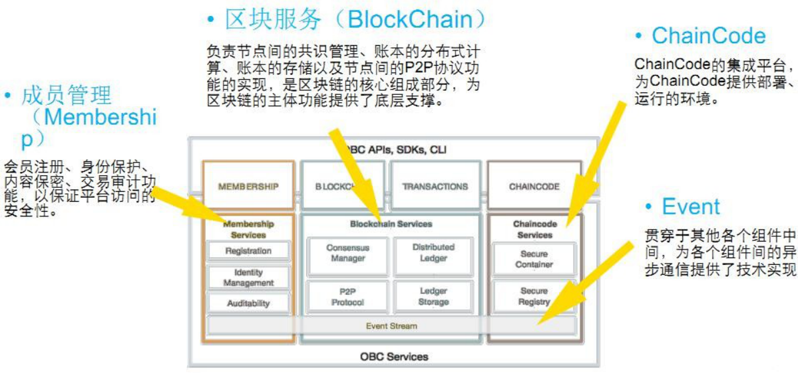
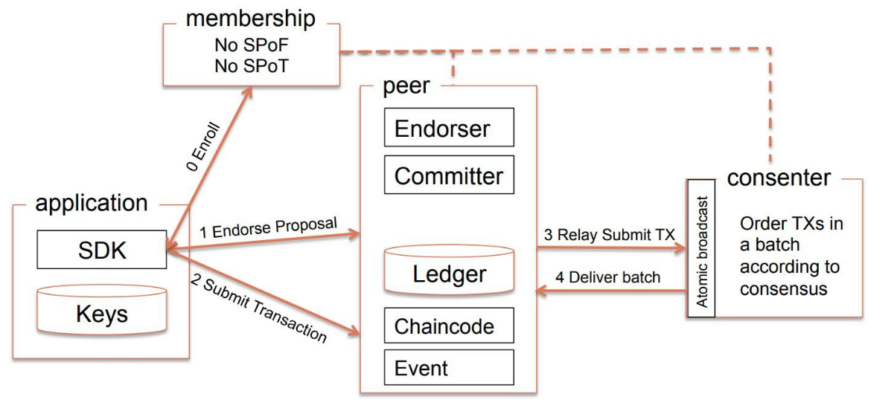
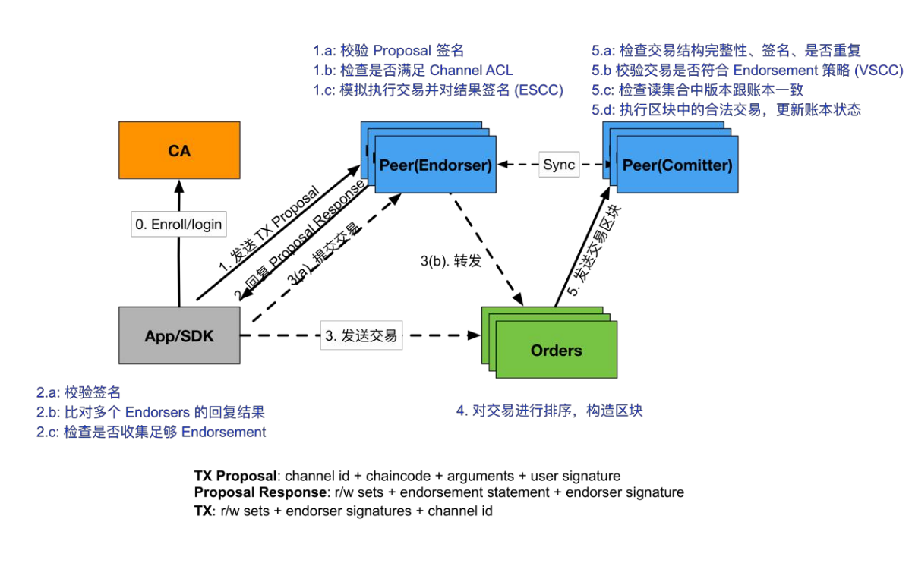
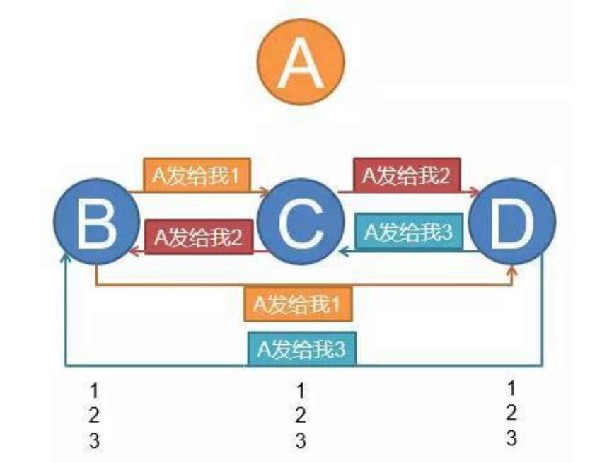
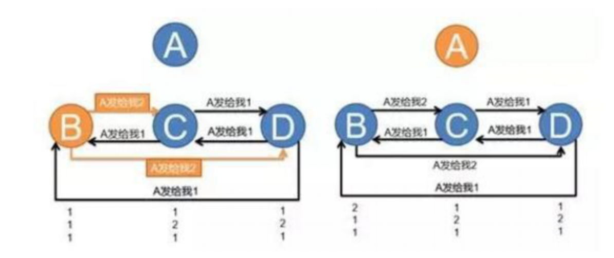

# 区块链的企业级解决方案 - Hyperledger

## 概览

略

## 构架

### 超级账本Fabric架构上核心特性主要包括：

* 解耦交易处理节点的逻辑角色为背书节点（`Endorser`）、 确认节点（`Committer`），可以根据负载进行灵活部署；
* 加强了身份证书管理服务，作为单独的`Fabric CA`项目，提供更多功能；
* 支持多通道特性，不同通道之间的数据彼此隔离，提高隔离安全性；(1.0+)
* 支持可拔插的架构，包括共识、权限管理、加解密、账本机 制都模块，支持多种类型；
* 引入系统链码来实现区块链系统的处理，支持可编程和第三 方实现。

###构架图

#### 成员管理

用于验证参与成员是否合法，是否是被认证的成员。目的是在入口位置提高平台的安全性

#### 区块服务

包含共识的管理，分布式的账本，账本存储空间，`p2p`的网络，交易会在这个上面执行

#### ChainCode

即区块链中的智能合约

#### Event 

以上构成都是基于事件驱动的，由事件触发所执行。

### 构架各部分关系

通过`hyperledger`开放的`SDK`和整个网络进行交互。

如果要和网络其他部分交互首先要和membership进行权限的校验（是否通过安全检验，判断是否整个网络的一员）。

`SDK`和`Peer`交互。Peer包含`Endorser`，`Committer`两部分，peer可能需要扮演不同的角色。`Ledger`也是`peer`的一部分，指区块链或者说超级账本。`chaincode`指智能合约，不存在`peer`中，但安装后会被保存到`peer`目录中，当事件触发将要执行智能合约的时候，此时`peer`创建一个`docker`容器，以一种隔离的环境去运行智能合约。`peer`会维护`chaincode`，`peer`会和装载了`chaincode`的容器进行交互，维护其生命周期。

`SDK`和`Order(consenter)`交互，例如需要创建一个区块的时候和加密一个区块的时候。

## Hyperledger Transaction Flow

###交易的流程

使用`CA`证书通过`SDK`，先发送一个目标的交易信息`TX Propossal`给所有`Endorser Peer`，所有`Endorser Peer` 将验证`Proposal`签名是否合法（通过`membership`工作验证），是否满足`channel`定义的规则，模拟执行交易并对执行结果签名（运行`docker`容器，必须是已经安装的智能合约）。将新签名的结果返回给`SDK`。

`SDK`再次提交交易给`Peer`，通过`Peer`转发给`Orders`，`Orders`对交易进行排序，以构造区块（需要解决一致性）。之后`orders`广播构造好的区块。`Comitter Peer`接受区块进行检查（5），

**TX Propossal包含的内容**

- channel id 交易将在哪个peer子区(channel)域执行
- ChainCode 想要运行的chaincode(智能合约)
- arguments 指chaincode参数
- user signature 用户的签名

**Proposal Response包含的内容**

- `r/w sets` 一些模拟执行使用的状态
- `endorsement statement` 背书，对模拟执行结果的背书
- `endorser signature` 签名说明是该peer执行的

## PBFT算法

**问题：**

拜占庭的n个将军围攻敌人，n个将军包围着敌人，忠诚的将军希望通过某种协议达成某个命令的一致（比如约定某个时间一起进攻）。但其中一些背叛 的将军会通过发送错误的消息阻挠忠诚的将军达成 命令上的一致。如果同时发起进攻的将军数量少于m个，那么不足以歼灭敌人，反而容易被敌人全部 歼灭。怎样做才能保证有多于m个将军在同一时间 一起发起进攻？

**默认假设：**

1. 所有忠诚的将军收到相同的命令后，执行 这条命令得到的结果一定是相同的；
2. 如果命令是正确的，那么所有忠诚的将军 必须执行这条命令。

**讨论：**

没有相互询问：

我们考虑4个将军的情况，同时假设4个将军中最多只有1个背叛者。当4个将军A、B、C、D把敌人包围了之后，必须协商一个统一的时间去 发起进攻。这时，A将军派出了3个传令兵，分别告诉B、C、D将军，  下午1点准时发起进攻。到了下午1点，A、C、D三个将军发起了进攻， 歼灭了敌人，同时他们三个发现B是背叛的。虽然B背叛了，但是对最终 任务没有影响。

但如果A是背叛的，会发生什么情况？A派出3个传令兵，分别告诉B、C、D将军在下午1点、2点、3点发起进攻。于是，到了下午1点，B将军去 攻击敌人，由于寡不敌众，全军覆没；2点，C将军全军覆没；3点，D  将军全军覆没。

相互询问：

​	PBFT算法的核心理论是n>=3f+1n是系统中的总节点数，f是允许出现故障的 节点数。换句话说，如果这个系统允许出现f个故障，那么这个系统必须包括n个节点， 才能解决故障。

​	假设总数N个节点, f个fault节点, 那么必须接收 到N-f个消息应答, 就能够判断出结果(因为fault  节点可能不发送应答).N-f个应答中有f个可能是假的(fault节点发出的), 那么真实的是N-f-f, 要求真实的应答大于假的 应答, 即N-f-f > f ==> N > 3f.

​	所以: N_min = 3f + 1

