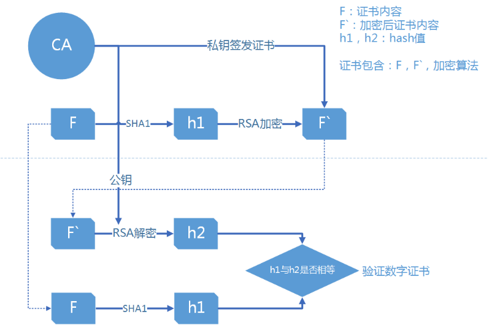

# Hyperledger实战（一）

## 环境搭建

[环境搭建文档](https://github.com/xinbingliang/blockchain.git)

### 端口说明

* 7050 order使用的端口
* 7051,7053 peer使用的端口，其中7053是event端口，事件监听从这里
* 5984 couchdb使用的
* 22 工具端口

### 镜像说明

* `dev-xxx` 是`chaincode`的镜像
* fabric-peer 端独节点
* fabric-orderer 
* fabric-ccenv 模拟运行时的go编译工具，提供chaincode的库，必须和peer一起
* fabric-baseos 操作系统   提供基础的运行环境
* fabric-baseimage 生成其他image的基础

````
docker run -it f9153dc33cd2 bash //运行容器
````

### 项目

`./fabric/examples/e2e_cli`

#### `.yaml` docker的配置文件

````
TwoOrgsOrdererGenesis:
        Orderer:	# order Organizations
            <<: *OrdererDefaults
            Organizations:
                - *OrdererOrg
        Consortiums:
            SampleConsortium:
                Organizations: # peer Organizations
                    - *Org1
                    - *Org2
        TwoOrgsChannel:
            Consortium: SampleConsortium
            Application:
                <<: *ApplicationDefaults
                Organizations: # 两个Organizations的Channel
                    - *Org1
                    - *Org2
````

* `AnchorPeers` 发现新的节点，节点数据同步，像路由一样 
* `BatchTimeout` 达到该时间打包
* `BatchSize` 达到该数据量打包

`crypto-config.yaml` 证书配置文件

## 样例剖析

### 工具介绍

./../../release/linux-amd64/bin/cryptogen generate --config=./crypto-config.yaml

### Chaincode介绍、运行、调试


## 数字证书




## MSP介绍


53