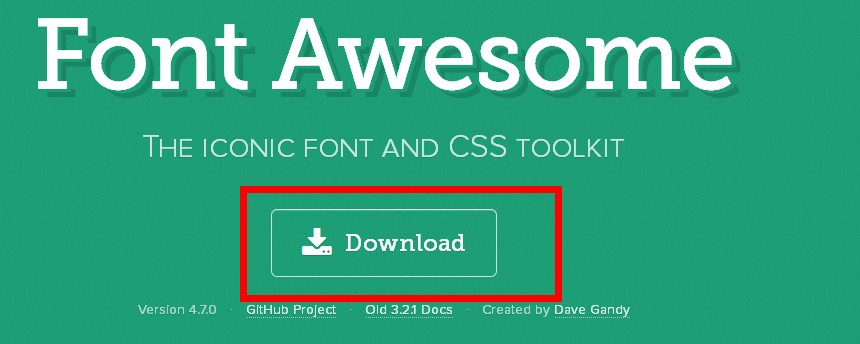
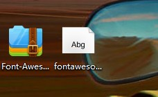
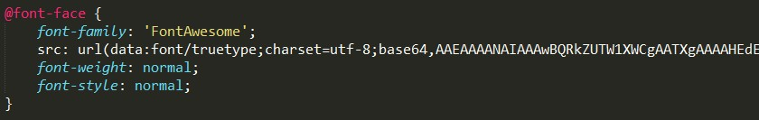
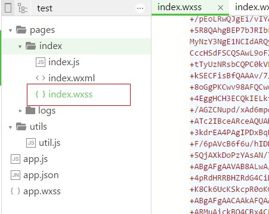
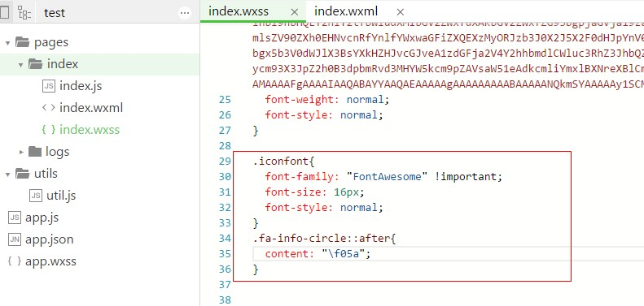
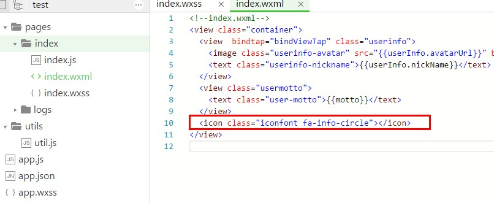
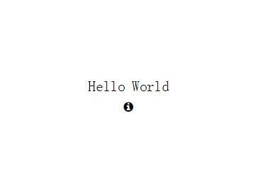

# 微信小程序使用字体图标的方法

## 下载字体

* 到[Fontawesome](http://fontawesome.io/)官网下载字体包

* 解压获得`ttf`文件

## 转换字体

* 到[transfonter](https://transfonter.org/)转换成`Base64`

先上传`ttf`文件，选择相关格式后，然后点击`Convert`，下载即可

* 找到下载文件夹中的`stylesheet.css`文件，整段复制

到微信`wxss`中

## 编写wxss

* 编写字体css

  

  如何知道`::after`的内容?`Fontawesome`官网每个图标点进去都能找到。

* 编写icon

## 效果

