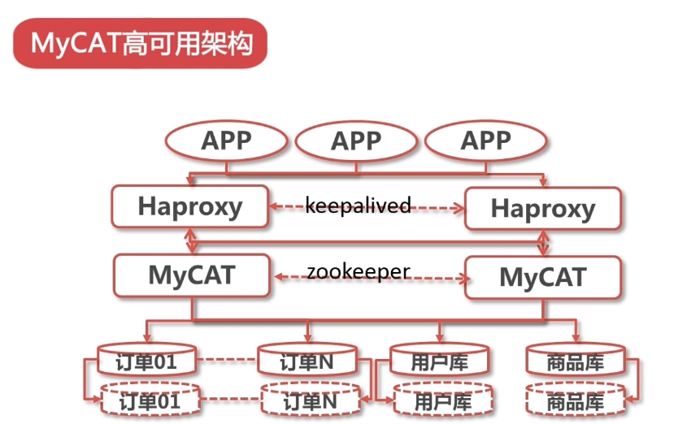
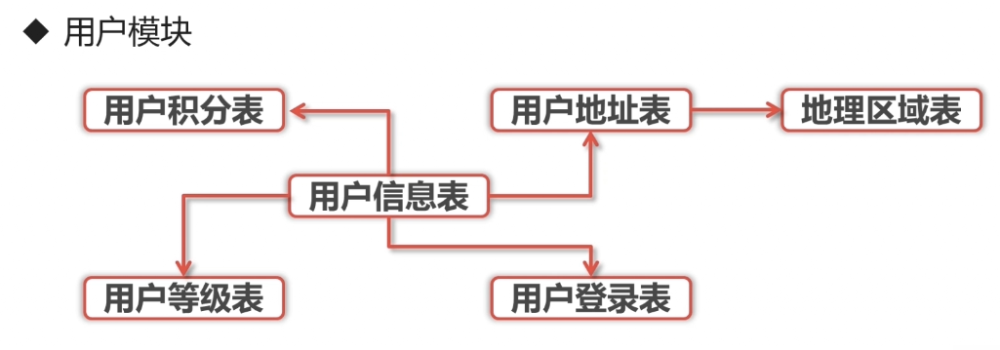
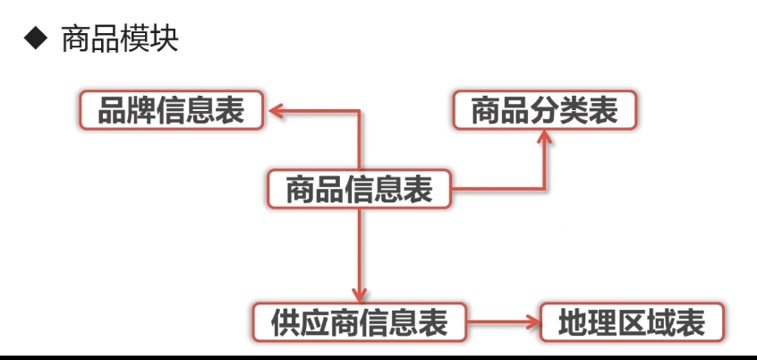
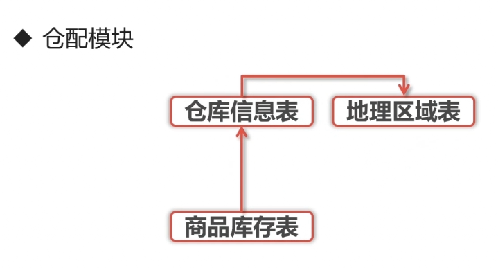
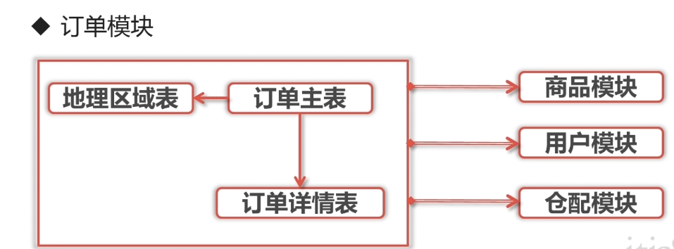

# 简介

## 高可用



## 知识点

* 高可用集群
* 读写分离
* 垂直分库
* 公共连接池
* 水平分库
* 监控及优化

## 数据库构成









## 什么是数据库中间层

* 对数据库进行分库分表和读写分离
* 隐藏数据库的存储逻辑

## MyCAT的主要作用

* 作为分布式数据库中间层
* 实现读写分离和负载均衡
* 进行垂直切分和水平切分
* 控制连接数量

## MyCAT基本元素

1. 逻辑库：多个数据路虚拟成一个数据库
2. 逻辑表：水平切分后虚拟的表
   * 分为分片表和非分片表
   * 全局表：在所有分片中都存在的表
   * ER关系表：按ER关系进行分片的表

## MyCAT安装

### 下载mycat

`````
wget http://dl.mycat.org.cn/1.6.5/Mycat-server-1.6.5-release-20180122220033-linux.tar.gz
tar -xvf Mycat-server-1.6.5-release-20180122220033-linux.tar.gz
`````

### 安装Java运行环境jdk1.7

````
wget http://download.oracle.com/otn-pub/java/jdk/7u79-b15/jdk-7u79-linux-x64.tar.gz
wget http://download.oracle.com/otn-pub/java/jdk/7u79-b15/jdk-7u79-linux-i586.tar.gz
rpm -qa | grep java
rpm -e --nodeps xxx

mkdir /usr/local/java
mv ./jdk1.7.0_79/ /usr/local/java/
````

### 新建myCat运行帐号

````
adduser mycat
mv mycat/ /usr/local/
chown -R mycat:mycat mycat
````

### 配置系统环境变量

`````
./bin
├── dataMigrate.sh
├── init_zk_data.sh
├── mycat
├── rehash.sh
├── startup_nowrap.sh //脚本启动mycat
├── wrapper-linux-ppc-64
├── wrapper-linux-x86-32
└── wrapper-linux-x86-64
`````

````
vim conf/wrapper.conf

wrapper.java.additional.5=-XX:MaxDirectMemorySize=512M # 服务使用的内存的大小
wrapper.java.additional.6=-Dcom.sun.management.jmxremote
````

````
vim /etc/profile
export JAVA_HOME=/usr/local/java/jdk1.7.0_79
export CLASSPATH=.:$JAVA_HOME/jre/lib/rt.jar:$JAVA_HOME/lib/dt.jar:$JAVA_HOME/lib/tools.jar
export PATH=$PATH:$JAVA_HOME/bin
export MYCAT_HOME=/usr/local/mycat
export PATH=$PATH:$MYCAT_HOME/bin


source /etc/profile
chmod +x /usr/local/java/jdk1.7.0_79/bin/*
````

### 修改启动参数


