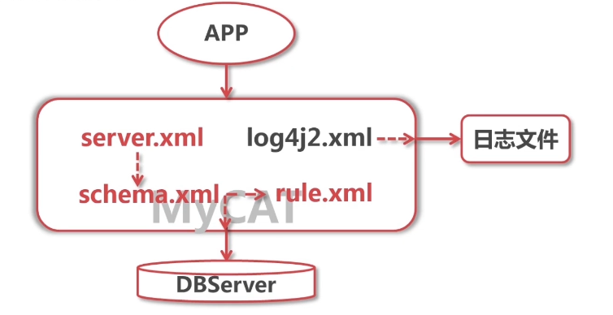
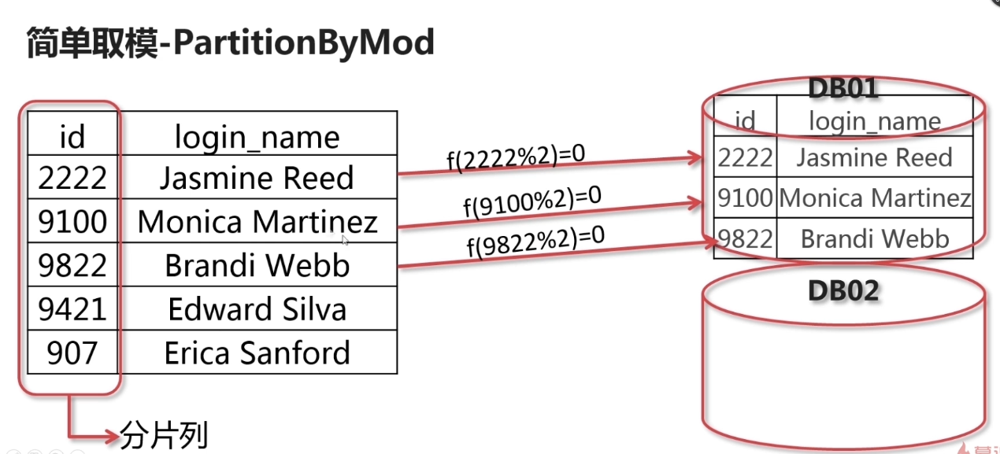
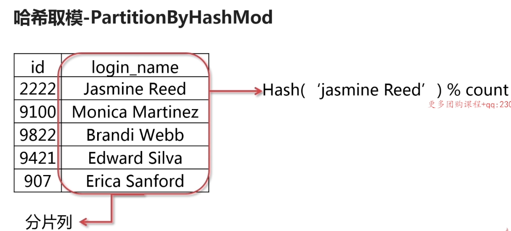
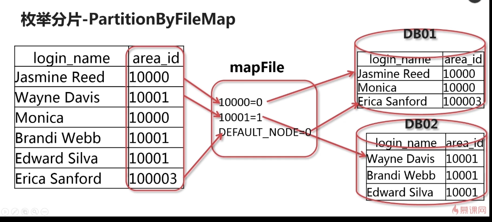
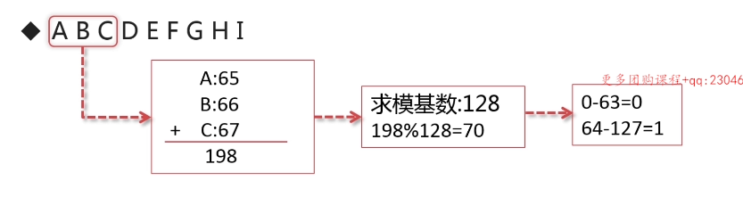
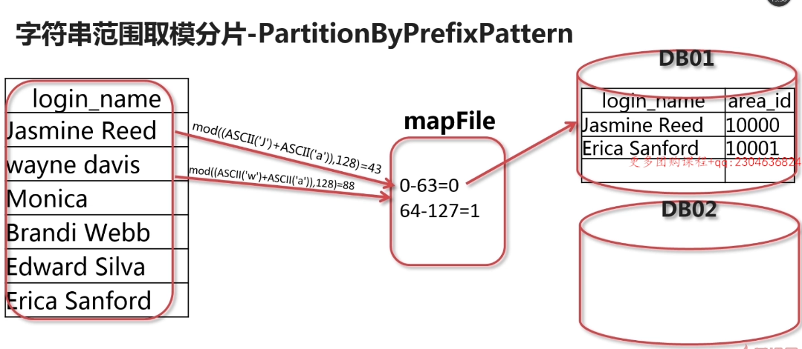

# MYCAT核心配置详解



* `server.xml`：对系统参数，用户权限
* `schema.xml`：配置逻辑库，逻辑表
* `log4j2.xml`：配置日志文件
* `rule.xml`：表进行了水平切分时使用的配置文件

## server.xml配置详解

* 配置系统祥光参数
* 配置用户访问权限
* 配置sql防火墙和SQL拦截功能

``````xml
<?xml version="1.0" encoding="UTF-8"?>
<!DOCTYPE mycat:server SYSTEM "server.dtd">
<mycat:server xmlns:mycat="http://io.mycat/">
    <system>
        <property name="serverPort">3306</property> <!-- 定义对外提供服务端口-->
        <property name="managerPort">9066</property> <!-- mycat管理端口 -->
        <property name="nonePasswordLogin">0</property><!-- 是否需要用户登录验证  0为需要密码登陆、1为不需要密码登陆 ,默认为0，设置为1则需要指定默认账户 -->
        <property name="bindIp">0.0.0.0</property> <!-- 监听的IP地址 -->
        <property name="frontWriteQueueSize">2048</property> <!-- 最大写大小 -->
        <property name="charset">utf8</property> <!-- 默认字符集 -->
        <property name="txIsolation">2</property> <!-- 隔离级别 -->
        <property name="processors">8</property> <!-- 进程数量 -->
        <property name="idleTimeout">1800000</property> <!-- 多长时间无连接断开，毫秒 -->
        <property name="sqlExecuteTimeout">300</property> <!-- 执行超时断开时间，秒 -->
        <property name="useSqlStat">0</property>
        <property name="useGlobleTableCheck">0</property>
        <property name="sequnceHandlerType">2</property>
        <property name="defaultMaxLimit">100</property> <!--返回数据集大小 100行 -->
        <property name="maxPacketsize">104857600</property> <!-- 数据包大小  和mysql须保持一致 -->
    </system>

    <!--<user name="root" defaultAcco="true">
        <property name="password">123456</property>
        &lt;!&ndash;<property name="schemas">imooc_db</property>&ndash;&gt;
        <property name="schemas">testdb,db1,db2</property> &lt;!&ndash; 多个数据库设置 &ndash;&gt;
        <property name="readOnly">flase</property> &lt;!&ndash; 是否只读 &ndash;&gt;
    </user>

    &lt;!&ndash;表级DML权限设置&ndash;&gt;
    <user name="test">
        <property name="password">123456</property>
        <property name="schemas">imooc_db</property>
        <privileges check="true"> &lt;!&ndash;true表示是否启用&ndash;&gt;
            <schema name="test1" dml="0110"> &lt;!&ndash;访问test1库 0110拥有的权限 未指定的表使用此dml&ndash;&gt;
                <table name="tb01" dml="0000"></table>&lt;!&ndash;表访问权限&ndash;&gt;
                <table name="tb02" dml="1111"></table>
            </schema>
        </privileges>
    </user>-->

    <user name="root" defaultAccount="true">
        <property name="password">123456</property>
        <property name="schemas">imooc_db</property>
        <!--表级DML权限设置-->
        <privileges check="true">
            <schema name="imooc_db" dml="0110">
                <table name="customer_inf" dml="0000"></table>
                <table name="customer_ level_inf" dml="1111"></table>
            </schema>
        </privileges>
    </user>
    <user name="user">
        <property name="password">123456</property>
        <property name="schemas">imooc_db</property>
        <property name="readOnly">true</property>
    </user>
</mycat:server>
``````

### dml

`````
1111
insert update select delete
`````

### 密码的加密

* `java -cp Mycat-server-1.6.5-release.jar io.mycat.util.DecryptUtil 0:root:123456` 

`````xml
 <user name="root" defaultAccount="true">
        <property name="usingDecrypt">1</property>
        <property name="password">GO0bnFVWrAuFgr1JMuMZkvfDNyTpoiGU7n/Wlsa151CirHQnANVk3NzE3FErx8v6pAcO0ctX3xFecmSr+976QA==</property>
        <property name="schemas">imooc_db</property>
        <!--表级DML权限设置-->
        <privileges check="true">
            <schema name="imooc_db" dml="0110">
                <table name="customer_inf" dml="0000"></table>
                <table name="customer_ level_inf" dml="1111"></table>
            </schema>
        </privileges>
    </user>
`````

* 重启服务
* `mysql -uroot -p -P9066` 测试连接

### 四种隔离级别

[文章](https://blog.csdn.net/weixin_44174165/article/details/89549023)

## log4j2.xml配置文件

* 配置输出日志的格式
* 配置输出日志的级别

````xml
<PatternLayout><!--日志输出格式 %5p 级别 %t 线程名 %m消息-->
	<Pattern>%d{yyyy-MM-dd HH:mm:ss.SSS} %5p [%t] (%l) - %m%n</Pattern>
</PatternLayout>
````

````xml
<!-- ALL < Trace < Debug < Info < Warn < Error < Fatal < Off -->
<asyncRoot level="info" includeLocation="true">
	<AppenderRef ref="RollingFile"/>
</asyncRoot>
````

## rule.xml文件详解

* 水平分表配置规则
* 配置分片规则对应的分片函数

``````xml
<tableRule name="rule1"> <!--分片规则名  尽量有意义-->
  <rule>
    <columns>id</columns> <!--指定分片时的分片列-->
    <algorithm>func1</algorithm> <!--对应的函数， 分片算法-->
  </rule>
</tableRule>
``````

`````xml
<function name="crc32slot" class="io.mycat.route.function.PartitionByCRC32PreSlot"><!--分片函数名 指定java方法-->
	<property name="count">2</property><!-- 要分片的数据库节点数量，必须指定，否则没法分片 -->
</function>
`````

##  常用分片算法

### 简单取模-PartitionByMod(仅能针对整数列)



````xml
<tableRule name="customer_login"><!--指定被操作的表-->
    <rule>
        <columns>customer_id</columns><!--指定字段名id-->
        <algorithm>mod-long</algorithm><!--定义分片函数名称-->
    </rule>
</tableRule>

<function name="mod-long" class="io.mycat.route.function.PartitionByMod">
    <property name="count">2</property><!--参数，取模基数-->
</function>
````

### 哈希取模-PartitionByHashMod



`````xml
<tableRule name="customer_login">
    <rule>
        <columns>login_name</columns>
        <algorithm>mod-long</algorithm>
    </rule>
</tableRule>

<function name="mod-long" class="io.mycat.route.function.PartitionByHashMod">
    <property name="count">2</property>
</function>
`````

### 分片枚举-PartitionByFileMap

根据枚举值来进行分片，例如根据序列id，异地存贮



`````xml
<function name="hash-int" class="io.mycat.route.function.PartitionByFileMap">
    <property name="mapFile"> <!--文件配置路径 -->
        partition-hash-int.txt
    </property>
    <property name="type">0</property>
    <property name="defaultNode">0</property>
</function>
`````

`````
10000=0 //从0开始
10001=1
DEFAULT_NODE=0
`````

* 人为指定存贮节点

### 字符串范围取模分片

类似订单后几位





````xml
<function name="s harding-by-prefix-pattern" class="io.my cat.route.function.PartitionByPrefixPattern">
    <property name="patternValue">128</property> <!--取模基数大小-->
    <property name="prefixLength">2</property><!--字符串前缀的长度-->
    <property name="mapFile">prefix-partition-pattern.txt</property><!--文件位置-->
</function>
````

## schema.xml文件用途

* 配置逻辑库逻辑表
* 配置逻辑表所存储的数据节点
* 配置数据节点所对应的物理数据库服务器信息

### 逻辑库

````xml
<schema name="testdb" checkSQLschema="false" sqlMaxLimit="1000"></schema>
````

* `name`属性定义逻辑库的名称，和物理库名可能不同
* `sqlMaxLimit` 每次查询返回的最大行数，-1表示关闭限制
* `checkSQLschema` 判断是否检查发给MyCAT的sql中是否含有库名

### 逻辑表

````xml
<table name="customer_login" primaryKey="customer_id" dataNode="logindb01,logindb02" rule="customer_login"/>
````

* `name` 逻辑表明，和物理表名必须一样
* `primaryKey` 指定主键
* `dataNode ` 数据节点位置
* `rule `  分片规则

### dataNode标签

定义逻辑表存储的物理数据库

`````xml
<data Nodename="imooc" dataHost="mysql0113" database="imooc_db"/>
`````

* `name`属性定义数据节点名称，必须唯一
* `dataHost` 主机组的名称
* `database` 物理数据库名

### dataHost标签

定义后端数据库主机信息

````
<dataHost name="mysql0103" maxCon="1000" minCon="10" balance="1" writeType="O" dbType="mysql" dbDriver="native"
          switchType="1">
    <!--name 服务器名 maxCon minCon最大最小链接数 balance 读写分离的方式 writeType 0/1 为0所有写操作都由第一个写服务器，1随机分配到写服务器pxc集群 dbType 数据库类型 dbDriver 数据库驱动 switchType 1/-1切换方式 -->
    <heartbeat>select user()</heartbeat> <!--心跳检测语句-->
    <writeHost host="192.168.1.3" url="192.168.1.3:3306" user="im_mycat" password="123456"><!--主服务器-->
        <readHost host="192.168.1.4" url="192.168.1.4:3306" user="im_mycat" password="123456"></readHost><!--读服务器-->
    </writeHost>
</dataHost>
````

balance

* 0：不开启读写分离机制 ，单服务器，读写敏感，不使用读写分离
* 1：全部的read Host与standby write Host参与select语句的负载均衡 
* 2：所有的read Host与write Host都参与select语句的负载均衡 ，写操作不大
* 3：所有read Host参与select语句的负载均衡，一主多从

### dataHost标签属性

### heartbeat标签

### writehost标签

````` xml
<?xml version="1.0"?>
<!DOCTYPE mycat:schemaSYSTEM "schema.dtd">
<mycat:schema xmlns:mycat="http://io.mycat/">
    <schema name="imooc_db" checkSQLschema="false" sqlMaxLimit="100">
        <table name="customer_login" primaryKey="customer_id" dataNode="logindbe1,logindb02" rule="customer_login"/>
    </schema>
    <dataNode name="logindb01" dataHost="mysql0103" database="login_db01"/>
    <dataNode name="logindb02" dataHost="mysql0103" database="login_db02"/>
    <dataHost name="mysql0103" maxCon="1000" minCon="10" balance="1" writeType="0" dbType="mysql" dbDriver="native"
          switchType="1">
        <heartbeat>select user()</heartbeat>
        <writeHost host="192.168.1.3" url="192.168.1.3：3306" user="im_mycat" password="123456">
            <readHost host="192.168.1.4" url="192.168.1.4：3306" user="im_user" password="123456"/>
        </writeHost>
        <writeHost host="192.168.1.4" url="192.168.1.4：3306" user="im_user" password="123456"/>
    </dataHost>
</mycat:schema>
`````

