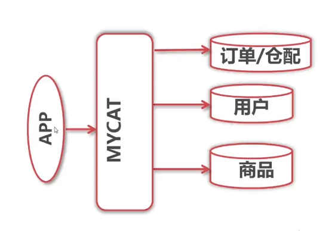
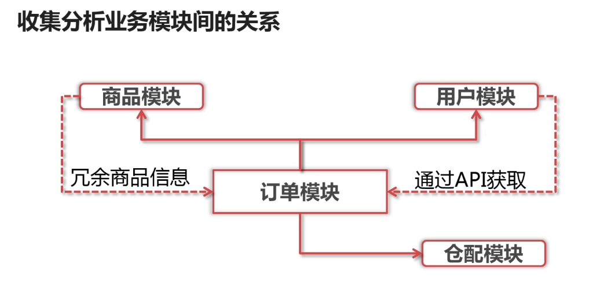

# 垂直分库分表

目的为分担写负载：

* 垂直分库：将不同表拆分到不同数据库
* 水平分库：将相同表拆分到不同数据库

## 步骤

1. 收集分析业务模块间的关系 
2. 复制数据库到其它实例 
3. 配置MyCAT垂直分库 
4. 通过MyCAT访问DB
5. 删除原库中已迁移表

## 复制数据到其他库

1. 备份原数据库并记录相关事务点 
2. 在原数据库中建立复制用户 
3. 在新实例上恢复备份数据库 
4. 在新实例上配置复址链路
5. 在新实例上启动复制

