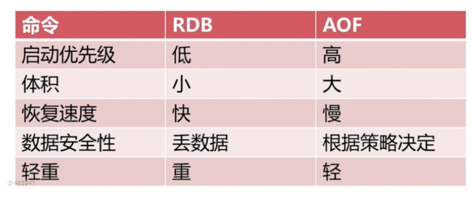

# Redis持久化的取舍和选择

## 持久化的作用

### 方式

1. 快照
   * mysql dump
   * Redis RDB
2. 写日志
   * Mysql Binlog
   * Hbase HLog
   * Redis AOF

## RDB

1. 耗时耗性能
2. 不可控，丢失数据

### 基本

将内存数据导出为二进制快照文件，重启时恢复、·

1. save 使用同步命令
2. bgsave 使用异步命令
3. 条件达到时自触发

新生成的save文件会替换老的

### 使用配置

|  配置  | seconds | changes |
| :--: | :-----: | :-----: |
| save |   900   |    1    |
| save |   300   |   10    |
| save |   60    |  10000  |

* changes 发生数据改变量
* seconds 距上次同步时间
* `dbfilename dump.rdb` 保存的文件名称
* `dir ./` 数据文件和日志文件保存到哪里
* `stop-writes-on-bgsave-error yes`  bgsave遇到问题时停止写
* `rdbcompression yes`  文件采用压缩格式
* `rdbchecksum yes` 是否进行检验

````
daemonize yes # 以守护进程形式启动
logfile /var/log/redis/redis-server-6379.log
# save 900 1
# save 300 10
# save 60 10000
dbfilename dump-${port}.rdb
dir /使用一个大硬盘路径
stop-writes-on-bgsave-error yes 
rdbcompression yes
rdbchecksum yes
````

`````
logfile /data/redis-server-6379.log
dbfilename dump-6379.rdb
dir /data
stop-writes-on-bgsave-error yes
rdbcompression yes
rdbchecksum yes
`````

### 触发机制

1. 全量复制
2. debug reload
3. shutdown 

````
docker run -d -v /root/redis/redis.conf:/usr/local/etc/redis/redis.conf -p 6379:6379 --name redistest redis /usr/local/etc/redis/redis.conf
````

## AOF

### 三种策略

* always：先到缓冲区然后写到磁盘
* everysec：每秒中写入，丢失一秒数据
* no：根据操作系统决定

|  命令  | always |     everysec     |  no  |
| :--: | :----: | :--------------: | :--: |
|  优点  | 不丢失数据  | 每秒钟一次fsync丢失一秒数据 |      |
|  缺点  | IO开销大  |      丢1秒数据       | 不可控  |

### AOF文件重写

* 减少磁盘占用
* 加速恢复速度

### AOF的两种方式

* bgrewriteaof命令

* AOF 重写配置

  |            配置名称             |      含义      |
  | :-------------------------: | :----------: |
  |  auto-aof-rewrite-min-size  | AOF文件重写需要的尺寸 |
  | auto-aof-rewrite-percentage |   AOF文件增长率   |

* 统计

  |       统计名        |      含义       |
  | :--------------: | :-----------: |
  | aof_current_size |  AOF当前尺寸（字节）  |
  |  aof_base_size   | AOF上次启动和重写的尺寸 |

### 使用AOF

````
appendonly yes
appendfilename "appendonly-${port}.aof"
appendfsync everysec # 每秒
dir /bigdiskpath
no-appendfsync-on-rewrite yes # 为no导致堵塞，最安全，为yes先写缓冲区，但可能会导致数据部分丢失，最多30S数据丢失
auto-aof-rewrite-percentage 100
auto-aof-rewrite-min-size 64mb
aof-load-truncated yes # 忽略出错的文件
````

## RDB和AOF之间抉择



### RDB 最佳

* 关闭
* 集中管理，大时间量的数据备份
* 从节点开启（redis经常单机多部署）

### AOF最佳

* 开：缓存和存储，只是当缓存时候关
* 集中管理
* everysync

### 最佳策略

* 小分片
* 根据策略决定
* 监控
* 足够内存

