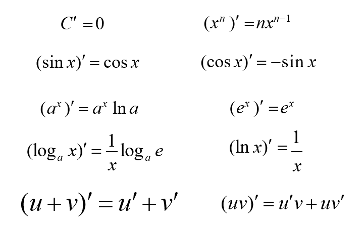
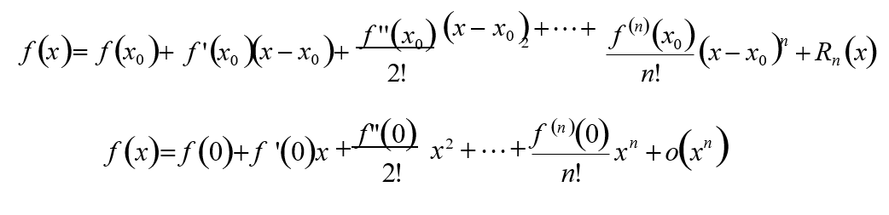

# 机器学习和数学分析

##机器学习

###定义

> 对于某个给定的任务T，在合理的性能度量方案P的前提下，某计算机程序可以自主学习任务T的经验E；随着提供合适、优质、大量的经验E，该程序对于任务T的性能逐步提高

* 任务Task,T,一个或多个
* 经验

###分类

* 有监督的学习：有特征提取的叫（认识月亮，夜空中发光的天体）
* 无监督的学习：单字经常出现在一起，那么就是一个词，相似性（阅兵）
* 增强学习：正向激励和反向激励，有反馈（走路、踢球）

## 数学

###导数 

* 导数就是曲线斜率，是曲线变化快慢的反应
* 二阶倒数是斜率变化快慢的反应，表征曲线的凹凸性
  * 加速度方向指向曲线凹的一侧（凸为凹割线在上方，凹为凸割线在下方）,上凸下凹

####常用导数

###积分

求曲线围成的面积

## Talyor公式-Maclaurin

* 常用于近似计算
* Gini系数

## 熵

对一个函数取对数然后求平均就是熵

104

