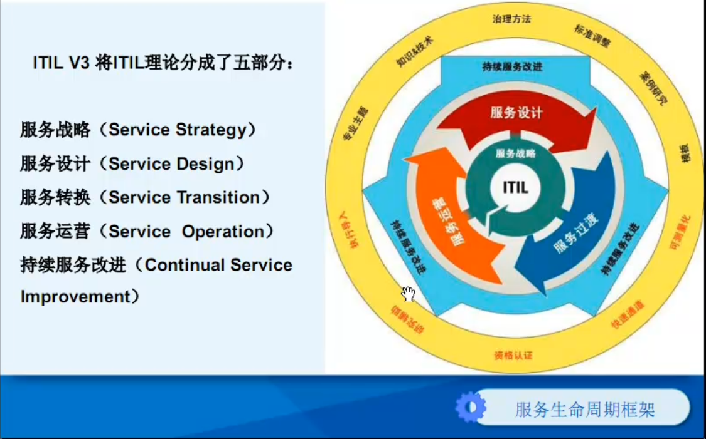
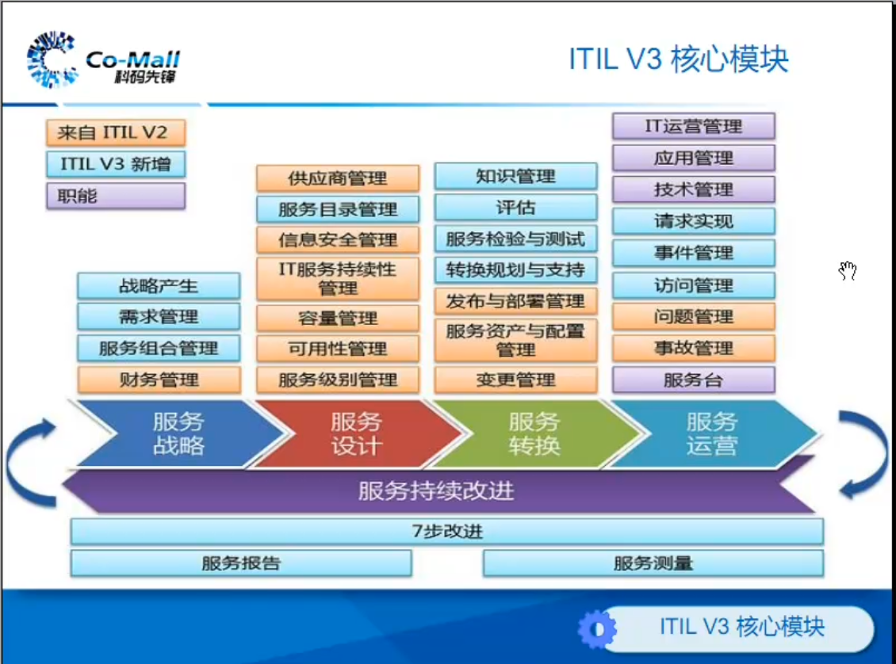
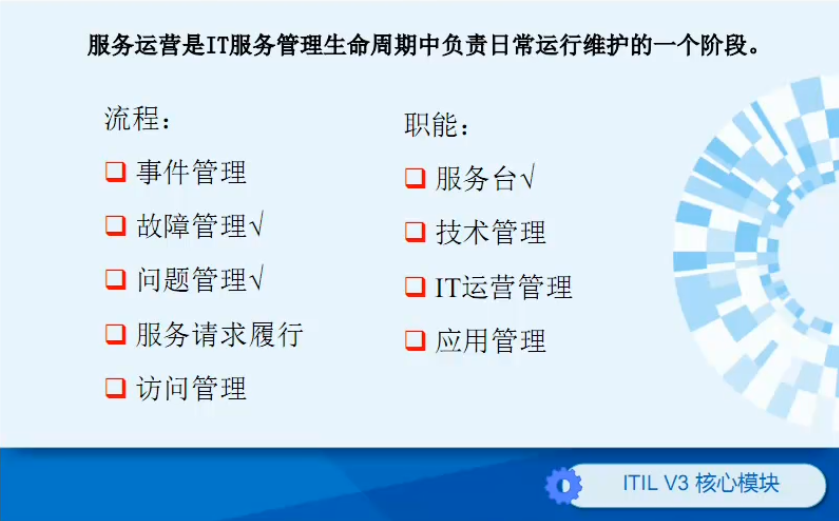
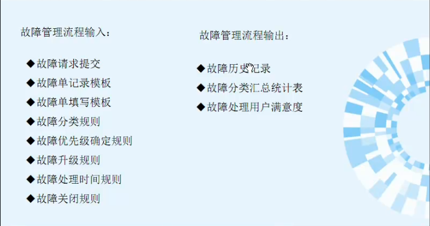
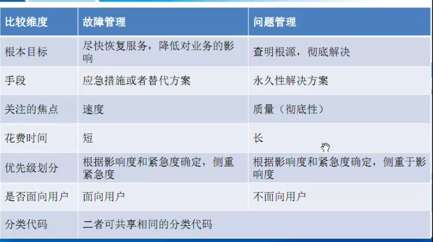

# ITIL

## 成为运维经理

1. 服务管理 ITLT
2. 项目管理 PMP
3. [PDCA](http://www.gztaiyou.com/Download/html/20121218103320.html)

##ITIL V3

###核心轮廓

* 服务战略
* 服务设计
* 服务转换
* 服务运营
* 持续服务改进

### 核心模块

###服务运营

* SLA：服务级别协议
* OLA：运营水平协议
* CSF：关键成功因素
* KPI：关键绩效指标

#### 服务台

1. 路由器
2. 监视器
3. 单点联系
4. 客服窗口
5. 广播台
6. 过滤器

#### 故障管理

* 第一是故障恢复

#### 问题管理

消除重复出现的 

