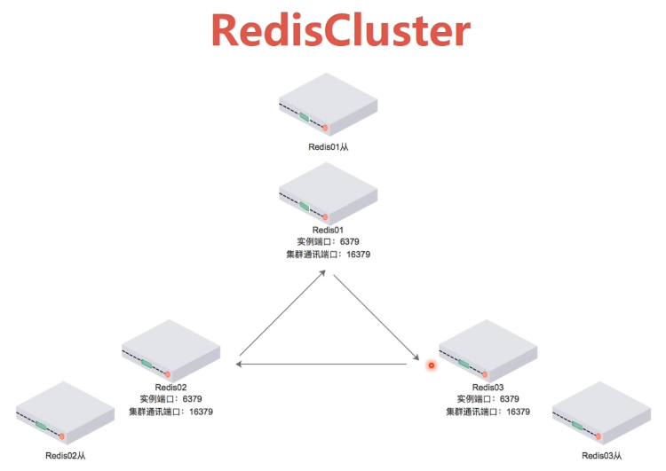

# Redis集群

## 介绍

* 无中心节点，客户端与redis节点直连，不需要中间代理层
* 数据可以被分片存储



## 主从同步

* redis集群的数据库复制是通过主从同步实现的
* 主节点(Master)把数据分发给从节点（Slave）
* 主从同步的好处在于高可用,Redis节点有冗余设计
* Master节点应该有奇数个，至少三个
* 每个Master都应该有Slave


## 创建集群

* `docker pull yyyyttttwwww/redis ` 拉取镜像
* `docker swarm leave -f` 解除swarm集群
* `docker network create net2`
* `docker run -it -d --name r1 -p 5001:6379 --net=net2 --ip 172.19.0.2 redis bash `

### 配置redis节点（容器内部）

`````
# /usr/redis/redis.conf
daemonize yes		# 以后台进程运行
cluster-enabled yes 	# 开启集群
cluster_config-file	nodes.conf	# 集群配置文件
cluster-node-timeout 	15000	# 超时时间
appendonly	yes	# 开启AOF模式，开启日志功能，用于数据恢复
`````

* 启动Redis

````
 # 进入r1节点
docker exec -it r1 bash
cp /home/redis/redis.conf /usr/redis/redis.conf
cd /usr/redis/src
./redis-server ../redis.conf
````

* 创建Cluster集群

````
 # 在r1节点上执行下面的指令
cd /usr/redis/src
mkdir -p ../cluster
cp redis-trib.rb ../cluster/
cd ../cluster
#创建Cluster集群
./redis-trib.rb create --replicas 1 172.19.0.2:6379 172.19.0.3:6379 172.19.0.4:6379 172.19.0.5:6379 172.19.0.6:6379 172.19.0.7:6379
````


 