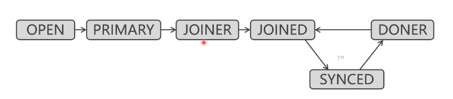
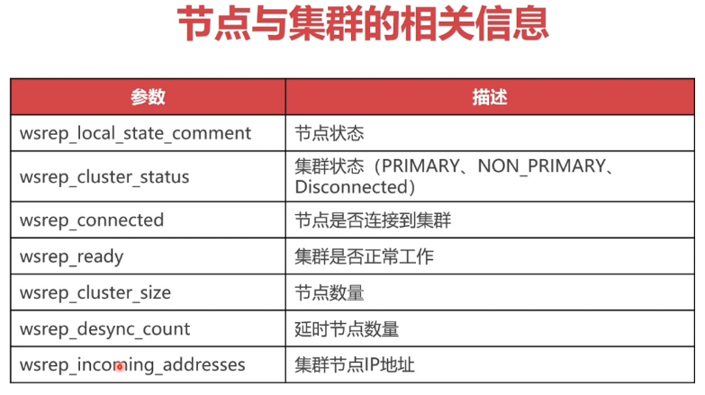

# 创建PXC集群

## CentOS安装PerconaServer数据库

只支持linux

* [下载链接位置](https://www.percona.com/downloads/Percona-Server-LATEST/)

````
wget https://repo.percona.com/apt/percona-release_latest.$(lsb_release -sc)_all.deb
sudo dpkg -i percona-release_latest.$(lsb_release -sc)_all.deb
sudo apt-get update
sudo apt-get install percona-server-server-5.7
````

* `service mysql start` 启动服务
* `firewall-cmd --zone=public --add-port=3306/tcp --permanent`设置防火墙开放3306端口，并永久生效
* `firewall-cmd --reload` 重新读取

````
vi /etc/mysql/percona-server.conf.d/mysqld.cnf

[mysqld]
character_set_server = utf8
bind-address = 0.0.0.0
#跳过DNS解析,云服务器远程访问慢的问题
skip-name-resolve

````

* 管理

  ````
  service mysql start
  service mysql stop
  service mysql restart
  ````

* 禁止数据库的自动启动

  ````
  update-rc.d -f  mysql disable
  ````

* 修改mysql密码

  `````
  mysql_secure_installation
  `````

* 创建远程管理员账户

  ````
  mysql -u root -p
  CREATE USER 'admin'@'%' IDENTIFIED BY 'admin';
  GRANT all privileges ON *.* TO 'admin'@'%';
  FLUSH PRIVILEGES;

  ````

* 修改密码

  `````
  vi /etc/mysql/percona-server.conf.d/mysqld.cnf
  删除skip-grant-tables

  service mysql restart
  `````

## 安装PXC组建集群

* 由最低配置服务器决定

* 只有InnoDB才会被同步

* 需要卸载mariadb

* 需要开放的端口

  |  端口  |           描述           |
  | :--: | :--------------------: |
  | 3306 |       mysql服务端口        |
  | 4444 | 请求全量同步（SST）端口，会引发集群的限速 |
  | 4567 |       数据节点之间通信端口       |
  | 4568 |     请求增量同步(IST)端口      |

### 安装

* [下载资源网址](https://www.percona.com/downloads/Percona-XtraDB-Cluster-LATEST/)
* [先安装源](https://www.percona.com/doc/percona-repo-config/percona-release.html#deb-based-gnu-linux-distributions)
* [使用apt安装](https://www.percona.com/doc/percona-xtradb-cluster/LATEST/install/apt.html)

### 创建远程账户

````
mysql -u root -p
CREATE USER 'admin'@'%' IDENTIFIED BY 'admin';
GRANT all privileges ON *.* TO 'admin'@'%';
FLUSH PRIVILEGES;
````

### 修改配置

````
vim /etc/mysql/percona-xtradb-cluster.conf.d/mysqld.cnf

character_set_server = utf8
bind-address = 0.0.0.0
skip-name-resolve
````

````
vim /etc/mysql/percona-xtradb-cluster.conf.d/wsrep.cnf

server-id=1  #PXC集群中MySQL实例的唯一ID，不能重复，必须是数字
wsrep_provider=/usr/lib/galera3/libgalera_smm.so
wsrep_cluster_name=pxc-cluster  #PXC集群的名称
wsrep_cluster_address=gcomm://192.168.2.30,192.168.2.62,192.168.2.171
wsrep_node_name=node2  #当前节点的名称
wsrep_node_address=192.168.2.30  #当前节点的IP
wsrep_sst_method=xtrabackup-v2  #同步方法（mysqldump、rsync、xtrabackup）
wsrep_sst_auth= admin:admin  #同步使用的帐户
pxc_strict_mode=ENFORCING  #同步严厉模式
binlog_format=ROW  #基于ROW复制（安全可靠）
default_storage_engine=InnoDB  #默认引擎
innodb_autoinc_lock_mode=2  #主键自增长不锁表
````

* `chmod -R 777 /var/run/mysqld/`

* 引导第一个节点

  ````
  /etc/init.d/mysql bootstrap-pxc
  ````

*  其他节点

  ````
  /etc/init.d/mysql restart
  ````

* 打印集群状态信息

  `````
  SHOW STATUS LIKE 'wsrep_cluster%';
  `````


## PXC集群的常用管理-数据库集群使用

### 集群状态信息

````
SHOW STATUS LIKE '%wsrep%';
````

* 队列
* 复制
* 流控
* 事务
* 状态

### 数据复制的相关信息

|           参数           |       描述       |
| :--------------------: | :------------: |
|   wsrep_last_applied   |    同步应用的次数     |
|  wsrep_lastcommitted   |     事务提交次数     |
|    wsrep_replicated    |   被其他节点复制的总数   |
| wsrep_replicated_bytes |  被其他节点复制的总数据量  |
|     wsrep_received     | 从其他节点收到的请求写入数  |
|  wsrep_received_bytes  | 从其他节点收到的同步数据总数 |

### 队列的相关信息

|             参数             |              描述               |
| :------------------------: | :---------------------------: |
|   wsrep_local_send_queue   |            发送队列的长度            |
| wsrep_local_send_queue_max |           发送队列的最大长度           |
| wsrep_local_send_queue_min |           发送队列的最小长度           |
| wsrep_local_send_queue_avg | 发送队列的平均长度，大说明同步有问题，网速和同步线程有问题 |
|   wsrep_local_recv_queue   |            接收队列的长度            |
| wsrep_local_recv_queue_max |           接收队列的最大长度           |
| wsrep_local_recv_queue_min |           接收队列的最小长度           |
| wsrep_local_recv_queue_avg |   接收队列的平均长度，大说明本地线程数量不够持久化    |

### 流量控制

* 节点添加，全量同步

|              参数              |                    描述                    |
| :--------------------------: | :--------------------------------------: |
| wsrep_flow_control_paused_ns |              流控暂停状态下花费的总时间               |
|  wsrep_flow_control_paused   |             流量控制暂停时间的占比（0~1）             |
|   wsrep_flow_control_sent    |               发送的流控暂停事件的数量               |
|   wsrep_flow_control_recv    |               接收的流控暂停事件的数量               |
| wsrep_flow_control_interval  | 流量控制的下限和上限。上限是队列中允许的最大请求数。如果队列达到上限，则拒绝新的请求。当处理现有请求时，队列会减少，一旦达到下限，将再次允许新的请求 |
|  wsrep_flow_control_status   |                 流量控制的状态                  |

````
vim /etc/mysql/percona-xtradb-cluster.conf.d/mysqld.cnf

# 修改线程数量，cpu的1~1.5倍
wsrep_slave_threads=16
````

## PXC集群的常用管理-状态参数

### 节点状态



* OPEN：数据节点服务启动成功
* PRIMARY：节点成功加入到集群
* JOINER：节点要与其他节点同步数据
* JOINED：数据同步成功
* DONER：其他节点与其进行全量同步
* SYNCED：对外可提供读写服务


* PRIMARY：正常状况
* NON_PRIMARY：出现脑裂
* DISCONNECTED：




## PXC节点的上线与关闭

节点如何启动就如何关闭

- `/var/lib/mysql/grastate.dat` 当safe_to_bootstrap为1时作为主节点
- `/etc/init.d/mysql stop` 关闭主节点

启动时要先启动为1

若全部为0，先修改一个为1后启动

## MySQL集群中间件比较

* 负载均衡
* 读写分离
* 数据切分

## 配置MyCat负载均衡

```
192.168.2.118,192.168.2.147,192.168.2.109
```


- `sudo apt-get install -y openjdk-8-jre`
- `sudo apt-get install -y openjdk-8-jkd`

```
# /etc/profile
#set jdk environment 
export JAVA_HOME=/usr/lib/jvm/java-8-openjdk-amd64
export JRE_HOME=$JAVA_HOME/jre 
export CLASSPATH=$JAVA_HOME/lib:$JRE_HOME/lib:$CLASSPATH 
export PATH=$JAVA_HOME/bin:$JRE_HOME/bin:$PATH 
```

- `source /etc/profile `
- `[http://www.mycat.io](http://www.mycat.io/)` 下载地址

```
mycat/
├── bin # 命令
├── catlet
├── conf # 配置文件
│   ├── rule.xml # 切分算法，将mod-log修改为分片数量
│   ├── server.xml # 虚拟MySQL，修改用户名，密码和逻辑库
│   ├── schema.xml # 数据库连接，读写分离，负载均衡，数据表映射
├── lib
├── logs # 日志
└── version.txt
```

```xml
<!-- server.xml -->
	<user name="admin" defaultAccount="true">
		<property name="password">123456</property>
		<property name="schemas">user</property> <!-- 数据库 -->
		
		<!-- 表级 DML 权限设置 -->
		<!-- 		
		<privileges check="false">
			<schema name="TESTDB" dml="0110" >
				<table name="tb01" dml="0000"></table>
				<table name="tb02" dml="1111"></table>
			</schema>
		</privileges>		
		 -->
	</user>


<!-- 只读用户，非必须 -->
<!-- 	<user name="user">
		<property name="password">user</property>
		<property name="schemas">TESTDB</property>
		<property name="readOnly">true</property>
	</user>
 -->

```

```xml
<!-- schema.xml -->
<!-- 定义虚拟的逻辑库及虚拟的逻辑表 -->
<schema name="test" checkSQLschema="false" sqlMaxLimit="100"> <!-- 定义虚拟的逻辑库 -->
		<table name="t_user" dataNode="dn1,dn2,dn3" rule="mod-long" /> <!-- 定义虚拟的逻辑表,dataNode:分片，rule:切分算法 -->
</schema>


<!-- name:分片的名称，dataHost:对应下面dataHost的name, databas:被操作的数据库-->
<dataNode name="dn1" dataHost="mycat1" database="db1" /> <!-- 定义的分片 -->
<dataNode name="dn2" dataHost="mycat2" database="db1" /> <!-- 定义的分片 -->

<!-- 数据库的连接信息 -->
	<!-- name:自定义一连接信息名称 maxCon minCon 数据库连接池信息 balance：负载均衡类型，0表示不开启读写分离，为1读写分离，为2每个节点同时负责读写，writeType：0表示所有写请求分发给第一个写节点，1表示写操作由所有写节点操作，switchType：切换节点的的依据，1使用mycat自己的心跳检测，用数据库集群的信息判断 -->
	<dataHost name="mycat1" maxCon="1000" minCon="10" balance="2"
			  writeType="1" dbType="mysql" dbDriver="native" switchType="1"  slaveThreshold="100">
		<heartbeat>select user()</heartbeat> <!-- 心跳检测的sql语句 -->
		<writeHost host="pxc1" url="192.168.232.167:3306" user="admin"
				   password="123456"> <!-- 配置写节点 -->
			<readHost host="pxc2" url="192.168.232.168:3306" user="admin" password="123456" /> <!-- 配置读节点 -->
          	<readHost host="pxc3" url="192.168.232.169:3306" user="admin" password="123456" /> <!-- 配置读节点 -->
		</writeHost>
      <!-- 一个冗余设计 -->
		<writeHost host="pxc2" url="192.168.232.168:3306" user="admin"
				   password="123456"> <!-- 配置写节点 -->
			<readHost host="pxc1" url="192.168.232.167:3306" user="admin" password="123456" /> <!-- 配置读节点 -->
          	<readHost host="pxc3" url="192.168.232.169:3306" user="admin" password="123456" /> <!-- 配置读节点 -->
		</writeHost>
	</dataHost>

<!-- 另外一个分片 -->
	<dataHost name="mycat2" maxCon="1000" minCon="10" balance="2"
			  writeType="1" dbType="mysql" dbDriver="native" switchType="1"  slaveThreshold="100">
		<heartbeat>select user()</heartbeat> <!-- 心跳检测的sql语句 -->
		<writeHost host="pxc1" url="192.168.232.167:3306" user="admin"
				   password="123456"> <!-- 配置写节点 -->
			<readHost host="pxc2" url="192.168.232.168:3306" user="admin" password="123456" /> <!-- 配置读节点 -->
          	<readHost host="pxc3" url="192.168.232.169:3306" user="admin" password="123456" /> <!-- 配置读节点 -->
		</writeHost>
      <!-- 一个冗余设计 -->
		<writeHost host="pxc2" url="192.168.232.168:3306" user="admin"
				   password="123456"> <!-- 配置写节点 -->
			<readHost host="pxc1" url="192.168.232.167:3306" user="admin" password="123456" /> <!-- 配置读节点 -->
          	<readHost host="pxc3" url="192.168.232.169:3306" user="admin" password="123456" /> <!-- 配置读节点 -->
		</writeHost>
	</dataHost>
```

```xml
# rule.xml
<function name="mod-long" class="io.mycat.route.function.PartitionByMod">
  <!-- how many data nodes -->
  <property name="count">2</property> <!-- 对应你的分片数量 -->
</function>
```

- `8066` 数据服务接口，也即数据读写连接端口
- `9066` 管理端口
- `cd bin && chomd -R 777 ./*.sh`
- `./startup_nowrap.sh`
- 杀死进程即关闭

## 数据切分

## 父子表

## 组建双机热备的MyCat集群-构建高可用的MyCat集群

## 组建双机热备的MyCat集群-利用keepalived抢占虚拟IP

## Sysbench基准测试-安装Sysbench

## Sysbench基准测试-使用Sysbench

## tpcc-mysql压力测试


