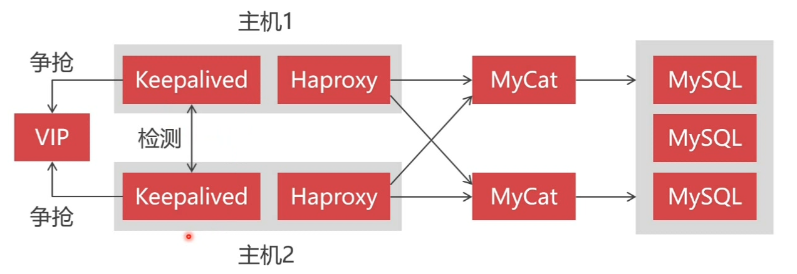

# 创建PXC集群

## CentOS安装PerconaServer数据库

只支持linux

* [下载链接位置](https://www.percona.com/downloads/Percona-Server-LATEST/)

````
wget https://repo.percona.com/apt/percona-release_latest.$(lsb_release -sc)_all.deb
sudo dpkg -i percona-release_latest.$(lsb_release -sc)_all.deb
sudo apt-get update
sudo apt-get install percona-server-server-5.7
````

* `service mysql start` 启动服务
* `firewall-cmd --zone=public --add-port=3306/tcp --permanent`设置防火墙开放3306端口，并永久生效
* `firewall-cmd --reload` 重新读取

````
vi /etc/mysql/percona-server.conf.d/mysqld.cnf

[mysqld]
character_set_server = utf8
bind-address = 0.0.0.0
#跳过DNS解析,云服务器远程访问慢的问题
skip-name-resolve

````

* 管理

  ````
  service mysql start
  service mysql stop
  service mysql restart
  ````

* 禁止数据库的自动启动

  ````
  update-rc.d -f  mysql disable
  ````

* 修改mysql密码

  `````
  mysql_secure_installation
  `````

* 创建远程管理员账户

  ````
  mysql -u root -p
  CREATE USER 'admin'@'%' IDENTIFIED BY 'admin';
  GRANT all privileges ON *.* TO 'admin'@'%';
  FLUSH PRIVILEGES;

  ````

* 修改密码

  `````
  vi /etc/mysql/percona-server.conf.d/mysqld.cnf
  删除skip-grant-tables

  service mysql restart
  `````

## 安装PXC组建集群

* 由最低配置服务器决定

* 只有InnoDB才会被同步

* 需要卸载mariadb

* 需要开放的端口

  |  端口  |           描述           |
  | :--: | :--------------------: |
  | 3306 |       mysql服务端口        |
  | 4444 | 请求全量同步（SST）端口，会引发集群的限速 |
  | 4567 |       数据节点之间通信端口       |
  | 4568 |     请求增量同步(IST)端口      |

### 安装

* [下载资源网址](https://www.percona.com/downloads/Percona-XtraDB-Cluster-LATEST/)
* [先安装源](https://www.percona.com/doc/percona-repo-config/percona-release.html#deb-based-gnu-linux-distributions)
* [使用apt安装](https://www.percona.com/doc/percona-xtradb-cluster/LATEST/install/apt.html)

### 创建远程账户

````
mysql -u root -p
CREATE USER 'admin'@'%' IDENTIFIED BY 'admin';
GRANT all privileges ON *.* TO 'admin'@'%';
FLUSH PRIVILEGES;
````

### 修改配置

````
vim /etc/mysql/percona-xtradb-cluster.conf.d/mysqld.cnf

character_set_server = utf8
bind-address = 0.0.0.0
skip-name-resolve
````

````
vim /etc/mysql/percona-xtradb-cluster.conf.d/wsrep.cnf

server-id=1  #PXC集群中MySQL实例的唯一ID，不能重复，必须是数字
wsrep_provider=/usr/lib/galera3/libgalera_smm.so
wsrep_cluster_name=pxc-cluster  #PXC集群的名称
wsrep_cluster_address=gcomm://192.168.2.30,192.168.2.62,192.168.2.171
wsrep_node_name=node2  #当前节点的名称
wsrep_node_address=192.168.2.30  #当前节点的IP
wsrep_sst_method=xtrabackup-v2  #同步方法（mysqldump、rsync、xtrabackup）
wsrep_sst_auth= admin:admin  #同步使用的帐户
pxc_strict_mode=ENFORCING  #同步严厉模式
binlog_format=ROW  #基于ROW复制（安全可靠）
default_storage_engine=InnoDB  #默认引擎
innodb_autoinc_lock_mode=2  #主键自增长不锁表
````

* `chmod -R 777 /var/run/mysqld/`

* 引导第一个节点

  ````
  /etc/init.d/mysql bootstrap-pxc
  ````

*  其他节点

  ````
  /etc/init.d/mysql restart
  ````

* 打印集群状态信息

  `````
  SHOW STATUS LIKE 'wsrep_cluster%';
  `````


## PXC集群的常用管理-数据库集群使用

### 集群状态信息

````
SHOW STATUS LIKE '%wsrep%';
````

* 队列
* 复制
* 流控
* 事务
* 状态

### 数据复制的相关信息

|           参数           |       描述       |
| :--------------------: | :------------: |
|   wsrep_last_applied   |    同步应用的次数     |
|  wsrep_lastcommitted   |     事务提交次数     |
|    wsrep_replicated    |   被其他节点复制的总数   |
| wsrep_replicated_bytes |  被其他节点复制的总数据量  |
|     wsrep_received     | 从其他节点收到的请求写入数  |
|  wsrep_received_bytes  | 从其他节点收到的同步数据总数 |

### 队列的相关信息

|             参数             |              描述               |
| :------------------------: | :---------------------------: |
|   wsrep_local_send_queue   |            发送队列的长度            |
| wsrep_local_send_queue_max |           发送队列的最大长度           |
| wsrep_local_send_queue_min |           发送队列的最小长度           |
| wsrep_local_send_queue_avg | 发送队列的平均长度，大说明同步有问题，网速和同步线程有问题 |
|   wsrep_local_recv_queue   |            接收队列的长度            |
| wsrep_local_recv_queue_max |           接收队列的最大长度           |
| wsrep_local_recv_queue_min |           接收队列的最小长度           |
| wsrep_local_recv_queue_avg |   接收队列的平均长度，大说明本地线程数量不够持久化    |

### 流量控制

* 节点添加，全量同步

|              参数              |                    描述                    |
| :--------------------------: | :--------------------------------------: |
| wsrep_flow_control_paused_ns |              流控暂停状态下花费的总时间               |
|  wsrep_flow_control_paused   |             流量控制暂停时间的占比（0~1）             |
|   wsrep_flow_control_sent    |               发送的流控暂停事件的数量               |
|   wsrep_flow_control_recv    |               接收的流控暂停事件的数量               |
| wsrep_flow_control_interval  | 流量控制的下限和上限。上限是队列中允许的最大请求数。如果队列达到上限，则拒绝新的请求。当处理现有请求时，队列会减少，一旦达到下限，将再次允许新的请求 |
|  wsrep_flow_control_status   |                 流量控制的状态                  |

````
vim /etc/mysql/percona-xtradb-cluster.conf.d/mysqld.cnf

# 修改线程数量，cpu的1~1.5倍
wsrep_slave_threads=16
````

## PXC集群的常用管理-状态参数

### 节点状态


* OPEN：数据节点服务启动成功
* PRIMARY：节点成功加入到集群
* JOINER：节点要与其他节点同步数据
* JOINED：数据同步成功
* DONER：其他节点与其进行全量同步
* SYNCED：对外可提供读写服务


* PRIMARY：正常状况
* NON_PRIMARY：出现脑裂
* DISCONNECTED：


## PXC节点的上线与关闭

节点如何启动就如何关闭

- `/var/lib/mysql/grastate.dat` 当safe_to_bootstrap为1时作为主节点
- `/etc/init.d/mysql stop` 关闭主节点

启动时要先启动为1

若全部为0，先修改一个为1后启动

## MySQL集群中间件比较

* 负载均衡
* 读写分离
* 数据切分

## 配置MyCat负载均衡

````
pxc1 192.168.2.34
pxc2 192.168.2.116
pxc3 192.168.2.159

pxc0-1i 192.168.2.118
pxc0-2 192.168.2.147
pxc0-3 192.168.2.109
mycat 192.168.2.167
````

- `sudo apt-get install -y openjdk-8-jre`
- `sudo apt-get install -y openjdk-8-jkd`

```
# /etc/profile
#set jdk environment 
export JAVA_HOME=/usr/lib/jvm/java-8-openjdk-amd64
export JRE_HOME=$JAVA_HOME/jre 
export CLASSPATH=$JAVA_HOME/lib:$JRE_HOME/lib:$CLASSPATH 
export PATH=$JAVA_HOME/bin:$JRE_HOME/bin:$PATH 
```

- `source /etc/profile `
- `[http://www.mycat.io](http://www.mycat.io/)` 下载地址

```
mycat/
├── bin # 命令
├── catlet
├── conf # 配置文件
│   ├── rule.xml # 切分算法，将mod-log修改为分片数量
│   ├── server.xml # 虚拟MySQL，修改用户名，密码和逻辑库
│   ├── schema.xml # 数据库连接，读写分离，负载均衡，数据表映射
├── lib
├── logs # 日志
└── version.txt
```

```xml
<!-- server.xml -->
	<user name="admin" defaultAccount="true">
		<property name="password">123456</property>
		<property name="schemas">user</property> <!-- 数据库 -->
		
		<!-- 表级 DML 权限设置 -->
		<!-- 		
		<privileges check="false">
			<schema name="TESTDB" dml="0110" >
				<table name="tb01" dml="0000"></table>
				<table name="tb02" dml="1111"></table>
			</schema>
		</privileges>		
		 -->
	</user>


<!-- 只读用户，非必须 -->
<!-- 	<user name="user">
		<property name="password">user</property>
		<property name="schemas">TESTDB</property>
		<property name="readOnly">true</property>
	</user>
 -->

```

```xml
<!-- schema.xml -->
<!-- 定义虚拟的逻辑库及虚拟的逻辑表 -->
<schema name="test" checkSQLschema="false" sqlMaxLimit="100"> <!-- 定义虚拟的逻辑库 -->
		<table name="t_user" dataNode="dn1,dn2,dn3" rule="mod-long" /> <!-- 定义虚拟的逻辑表,dataNode:分片，rule:切分算法 -->
</schema>


<!-- name:分片的名称，dataHost:对应下面dataHost的name, databas:被操作的数据库-->
<dataNode name="dn1" dataHost="mycat1" database="db1" /> <!-- 定义的分片 -->
<dataNode name="dn2" dataHost="mycat2" database="db1" /> <!-- 定义的分片 -->

<!-- 数据库的连接信息 -->
	<!-- name:自定义一连接信息名称 maxCon minCon 数据库连接池信息 balance：负载均衡类型，0表示不开启读写分离，为1读写分离，为2每个节点同时负责读写，writeType：0表示所有写请求分发给第一个写节点，1表示写操作由所有写节点操作，switchType：切换节点的的依据，1使用mycat自己的心跳检测，用数据库集群的信息判断 -->
	<dataHost name="mycat1" maxCon="1000" minCon="10" balance="2"
			  writeType="1" dbType="mysql" dbDriver="native" switchType="1"  slaveThreshold="100">
		<heartbeat>select user()</heartbeat> <!-- 心跳检测的sql语句 -->
		<writeHost host="pxc1" url="192.168.232.167:3306" user="admin"
				   password="123456"> <!-- 配置写节点 -->
			<readHost host="pxc2" url="192.168.232.168:3306" user="admin" password="123456" /> <!-- 配置读节点 -->
          	<readHost host="pxc3" url="192.168.232.169:3306" user="admin" password="123456" /> <!-- 配置读节点 -->
		</writeHost>
      <!-- 一个冗余设计 -->
		<writeHost host="pxc2" url="192.168.232.168:3306" user="admin"
				   password="123456"> <!-- 配置写节点 -->
			<readHost host="pxc1" url="192.168.232.167:3306" user="admin" password="123456" /> <!-- 配置读节点 -->
          	<readHost host="pxc3" url="192.168.232.169:3306" user="admin" password="123456" /> <!-- 配置读节点 -->
		</writeHost>
	</dataHost>

<!-- 另外一个分片 -->
	<dataHost name="mycat2" maxCon="1000" minCon="10" balance="2"
			  writeType="1" dbType="mysql" dbDriver="native" switchType="1"  slaveThreshold="100">
		<heartbeat>select user()</heartbeat> <!-- 心跳检测的sql语句 -->
		<writeHost host="pxc1" url="192.168.232.167:3306" user="admin"
				   password="123456"> <!-- 配置写节点 -->
			<readHost host="pxc2" url="192.168.232.168:3306" user="admin" password="123456" /> <!-- 配置读节点 -->
          	<readHost host="pxc3" url="192.168.232.169:3306" user="admin" password="123456" /> <!-- 配置读节点 -->
		</writeHost>
      <!-- 一个冗余设计 -->
		<writeHost host="pxc2" url="192.168.232.168:3306" user="admin"
				   password="123456"> <!-- 配置写节点 -->
			<readHost host="pxc1" url="192.168.232.167:3306" user="admin" password="123456" /> <!-- 配置读节点 -->
          	<readHost host="pxc3" url="192.168.232.169:3306" user="admin" password="123456" /> <!-- 配置读节点 -->
		</writeHost>
	</dataHost>
```

```xml
# rule.xml
<function name="mod-long" class="io.mycat.route.function.PartitionByMod">
  <!-- how many data nodes -->
  <property name="count">2</property> <!-- 对应你的分片数量 -->
</function>
```

- `8066` 数据服务接口，也即数据读写连接端口
- `9066` 管理端口
- `cd bin && chomd -R 777 ./*.sh`
- `./startup_nowrap.sh`
- `ps -aux | grep mycat`杀死进程即关闭

`````sql
use mytest;
insert into t_user(id, username, password, tel, locked)
values(
  1,
  'xin',
  HEX(AES_ENCRYPT('123456', 'HelloWorld')),
  '15102724511',
  false
)
`````

## 数据切分

| 切分算法   | 适用场合           | 备注     |
| ------ | -------------- | ------ |
| 主键求模切分 | 数据增长速度慢，难于增加分片 | 有明确主键值 |
| 枚举值切分  | 归类存储数据，适合大多数业务 |        |
| 主键范围切分 | 数据快速增长，容易增加分片  | 有明确主键值 |
| 日期切分   | 数据快速增长，容易增加分片  |        |

### 主键求模切分

- 球磨切分适合数据量大，但数据增长不快的场景，地图产品、行政数据、企业数据
- 扩展分片难度大，迁移数据量大，增加分片时使用原有分片的2n倍

### 枚举值切分

- 按照某字段的值（数字）来切分数据，用来归类数据

```xml
	<tableRule name="sharding-customer"><!-- 名称可以自由修改 -->
		<rule>
			<columns>sharding_id</columns> <!-- 数据表中特定的字段名称 -->
			<algorithm>hash-int</algorithm> <!-- 对应的底层算法 -->
		</rule>
	</tableRule>
```

```
# /mycat/conf/customer-hash-init.txt
# 字段的枚举值，例如商品分类编号
101=0
102=0
103=0
104=1
105=1
101=1
```

```xml
<!-- rule.xml -->
<tableRule name="sharding-by-intfile"> <!-- 原 -->
  <rule>	
  	<columns>sharding_id</columns>
  	<algorithm>hash-int</algorithm>
  </rule>
</tableRule>

<tableRule name="sharding-customer">
  <rule>
  	<columns>sharding_id</columns> <!-- 指定的字段 -->
  	<algorithm>customer-hash-int</algorithm> <!-- 自定义的切分算法 -->
  </rule>
</tableRule>

.....
<function name="hash-int"
		class="io.mycat.route.function.PartitionByFileMap">    <!-- 原 -->
		<property name="mapFile">partition-hash-int.txt</property>
</function>
<function name="customer-hash-int"
		class="io.mycat.route.function.PartitionByFileMap">   
		<property name="mapFile">customer-hash-init.txt</property><!-- 自定义枚举切分的文件 -->
</function>
```

`````xml
<!-- schema.xml -->
<schema name="user" checkSQLschema="false" sqlMaxLimit="100">
	<table name="t_user" dataNode="dn1,dn2" rule="mod-long" />
	<table name="t_customer" dataNode="dn1,dn2" rule="sharding-customer" />
</schema>	
`````

- `reload @@config_all;` 重新热加载

## 父子表

在MyCat中不允许跨分片做表连接查询

父子表：对父表进行切分对子表不允许切分

```xml
<!-- schema.xml -->
<schema name="test" checkSQLschema='false' sqlMaxLimit="100">
    <table name="t_customer" dataNode="dn1,dn2" rule="sharding-customer">
        <childTable name="t_orders" primaryKey="ID" joinKey="customer_id"   
                    parentKey="id"/> <!-- primaryKey:非必须，joinKey子表字段，parentKey父表字段，子表可以包含字表，也可以有多个字表 -->
    </table>
</schema>
```

## 组建双机热备的MyCat集群-构建高可用的MyCat集群



使用虚拟IP，实现抢占IP

Haproxy每秒转发八万次请求，Mysql要大量集群，MyCat要少量集群，Haproxy不需要集群

### haproxy

可以选择部署到新的机器上也可以和myca同机器

- 关闭防火墙

  - 3306 TCP/IP转发端口
  - 4001 监控界面

- `apt-get install haproxy`

- `vim /etc/haproxy/haproxy.cfg`

  ```
  global
      log         127.0.0.1 local2
      chroot      /var/lib/haproxy
      pidfile     /var/run/haproxy.pid
      maxconn     4000
      user        haproxy
      group       haproxy
      daemon
      # turn on stats unix socket
      stats socket /var/lib/haproxy/stats

  defaults
      mode                    http
      log                     global
      option                  httplog
      option                  dontlognull
      option http-server-close
      option forwardfor       except 127.0.0.0/8
      option                  redispatch
      retries                 3
      timeout http-request    10s
      timeout queue           1m
      timeout connect         10s
      timeout client          1m
      timeout server          1m
      timeout http-keep-alive 10s
      timeout check           10s
      maxconn                 3000

  # 监控服务设置
  listen   admin_stats  
      bind    0.0.0.0:4001 # 监控界面访问的IP和端口
      mode  http # 访问协议
      stats uri       /dbs # URI相对地址
      stats realm  Global\ statistics # 统计报告格式
      stats auth    admin:abc123456 # 登录帐号信息
  listen   proxy-mysql
      bind    0.0.0.0:3306  
      mode  tcp 
      # 轮训算法：roundrobin
      # 权重算法：static-rr
      # 最少连接算法：leastconn
      # 请求源IP算法：source
      balance  roundrobin # 使用轮训算法进行请求转发
      option  tcplog       # 日志格式
      server   mycat_1  192.168.99.131:8066  check  port  8066  weight  1  maxconn  2000  # mycat的负载均衡设置，8066为心跳检测端口，权重在权重算法中有效
      server   mycat_2  192.168.99.132:8066  check  port  8066  weight  1  maxconn  2000  
      option  tcpka        #使用keepalive检测死链
  ```

- `service haproxy start`

## 组建双机热备的MyCat集群-利用keepalived抢占虚拟IP

````
firewall-cmd --direct --permanent --add-rule ipv4 filter InPUT 0 --protocol vrrp -j ACCEPT
firewall-cmd --reload
````

- 关闭防火墙，以支持VRRP协议

- `apt-get install keepalived`

- `ip address` 查看虚拟网卡信息，注意网卡名称

- `vim /etc/keepalived/keepalived.conf`

  ```
  vrrp_instance  VI_1 { # 这一组配置的名称
      state  MASTER # 表示keepalived要争抢IP，当启动时，就会和其他节点一起抢占虚拟IP
      interface  ens33 # 对应网卡名称
      virtual_router_id  51 # 虚拟路由的标识，设备的ID号，0-255之间，两个节点不同
      priority  100 # 优先级，一种权重
      advert_int  1 # 心跳检测间隔，秒
      authentication { # 心跳检测的账户名
          auth_type  PASS
          auth_pass  123456
      }
      virtual_ipaddress { # 定义虚拟IP的地址, 两个机器一致， 和宿主机的ip在一个网段
          192.168.99.133
      }
  }
  ```

  ``````
  vrrp_instance  VI_1 {
      state  MASTER
      interface  ens33
      virtual_router_id  51
      priority  100
      advert_int  1
      authentication {
          auth_type  PASS
          auth_pass  123456
      }
      virtual_ipaddress { 
          192.168.99.133
      }
  }
  ``````

- `service keepalived start` 

- `ping 192.168.99.133` 测试keepalived 

- 通过上述设置的虚拟IP能访问，使用mycat用户名密码

- `service keepalived stop` 模拟宕机

- ​

## Sysbench基准测试-安装Sysbench

- QPS：每秒能处理完成的请求次数
- TPS ：每秒钟执行完成的事务次数
- 响应时间：一次请求所需要的平均处理时间
- 并发量：系统能同时处理的请求数

### Sysbench测试

- `sysbench --test=threads --num-threads=64 --thread-yields=100 --thread-locks=2 run` 线程测试
- `sysbench --test=cpu --cpu-max-prime=20000 run` CPU测试
- `sysbench --test=oltp --mysql-table-engine=myisam --oltp-table-size=1000000 ` 数据库测试
- `sysbench --test=memory --memory-block-size=8k --memory-total-size=4G run` 内存测试
- `sysbench --test=fileio --num-threads=16 --file-total-size=3G --file-test-mode=rndrw run` 磁盘测试

#### 安装

- `apt-get install sysbench`

## Sysbench基准测试-使用Sysbench

使用Haproxy代理三个pxc节点

### 连接参数

|       参数名称       | 功能意义 |
| :--------------: | :--: |
|   --mysql-host   | IP地址 |
|   --mysql-port   | 端口号  |
|   --mysql-user   | 用户名  |
| --mysql-password |  密码  |

### 执行参数

|        参数名称         |                   功能意义                   |
| :-----------------: | :--------------------------------------: |
|  --oltp-test-mode   | 执行模式（simple【测试查询，不测试写入】、nontrx【测试无事务增删改查】、complex【有事务增删改查】） |
| --oltp-tables-count |                  测试表的数量                  |
|  --oltp-table-size  |                 测试表的记录数                  |
|      --threads      |                  并发连接数                   |
|       --time        |                测试执行时间（秒）                 |
|  --report-interval  |              生成报告单的间隔时间（秒）               |

|  命令名称   |  功能意义  |
| :-----: | :----: |
| prepare | 准备测试数据 |
|   run   | 执行测试数据 |
| cleanup | 清除测试数据 |

- `vim /etc/haproxy/haproxy.cfg` 对数据库节点做负载均衡

```
    option  tcplog       # 日志格式
    server   mysql_1  192.168.99.131:3306  check  port  8066  weight  1  maxconn  2000  # mycat的负载均衡设置，8066为心跳检测端口，权重在权重算法中有效
    server   mysql_1  192.168.99.132:3306  check  port  8066  weight  1  maxconn  2000  
    option  tcpka        #使用keepalive检测死链
```

- sbtest  创建测试用数据库
- `sysbench  /usr/share/sysbench/oltp_common.lua --mysql-host=192.168.99.131 --mysql-port=3306 --mysql-user=admin --mysql-password=Abc_123456 --oltp-tables-count=10 --oltp-table-size=100000 prepare` 准备测试库
- `sysbench  /usr/share/sysbench/oltp_common.lua --mysql-host=192.168.99.131 --mysql-port=3306 --mysql-user=admin --mysql-password=Abc_123456 --oltp-test-mode=complex --threads=10 --time=300 --report-interval=10 run >> /home/mysysbench.log` 执行测试
- `sysbench  /usr/share/sysbench/oltp_common.lua --mysql-host=192.168.99.131 --mysql-port=3306 --mysql-user=admin --mysql-password=Abc_123456 --oltp-test-mode=complex --threads=10 --time=300 --report-interval=10 run >> /home/mysysbench.log` 清理数据，建议直接删除库

实际测试24小时以上

## tpcc-mysql压力测试

### 准备工作

使用haproxy做三个节点的负载均衡

- 修改my.cnf配置文件，每一个节点都要修改

  ```
  vi /etc/my.cnf
  pxc_strict_mode=DISABLED # 允许创建不合乎规范的表
  ```

- 修改某个Haproxy的配置文件

  ```
  server   mysql_1  192.168.99.151:3306  check  port  3306  weight  1  maxconn  2000
  server   mysql_2  192.168.99.159:3306  check  port  3306  weight  1  maxconn  2000
  server   mysql_3  192.168.99.215:3306  check  port  3306  weight  1  maxconn  2000
  ```

- 重新启动Haproxy

- 安装依赖程序包

  ```
  yum install -y gcc
  yum install -y mysql-devel
  ```

### 安装tpcc-mysql

- 下载压缩包

  [https://codeload.github.com/Percona-Lab/tpcc-mysql/zip/](https://codeload.github.com/Percona-Lab/tpcc-mysql/zip/master)[master](https://codeload.github.com/Percona-Lab/tpcc-mysql/zip/master)

- 执行安装

  ```
  #cd tpcc的src目录
  make
  ```

- 创建`tpcc-mysql`库

- 执行`create_table.sql`和`add_fkey_idx.sql`两个文件

- 执行数据初始化

  ```
  ./tpcc_load -h 192.168.99.131 -d tpcc -u admin -p Abc_123456 -w
  ```

- 执行压力测试

  ```
  ./tpcc_start -h 192.168.99.131 -d tpcc -u admin -p Abc_123456 -w 1 -c 5 -r 300 -l 600 ->tpcc-output-log
  ```